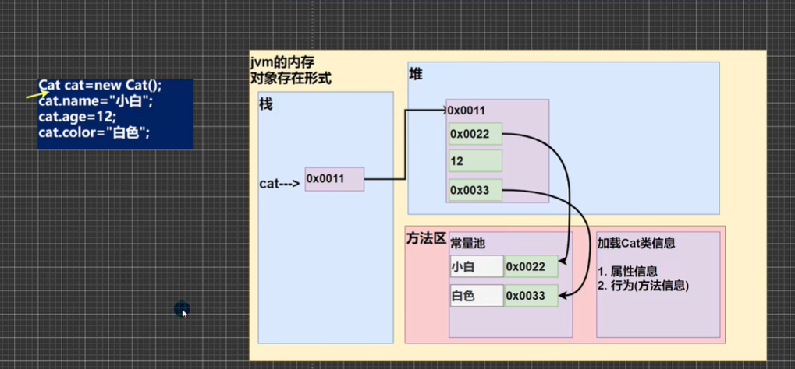
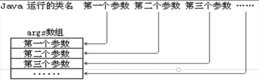

1. 类和对象
   1. 类的数据在内存中存储形式
      1. 
      2. 栈：一般存放基本数据类型，局部变量
      3. 堆：存放对象。
      4. 方法区：常量池(常量，比如字符串)，类加载信息
   2. 成员方法传参机制
      1. 基本数据类型，传递的是值，形参的任何改变不影响实参，随调用栈一起销毁
      2. 引用类型传递的是地址值，可以通过形参影响实参
   3. 方法重载
      1. 在同一个类中，存在多个同名方法，但是形参不同，返回类型不要求
   4. 可变参数
      1. 同一个类中多个同名同功能但参数个数不同的方法 
      2. 方法名(数据类型... 形参名){}
      3. 这时形参可以当作数组使用
   5. 作用域
      1. 全局变量：定义在类中的属性，可以不进行赋值有默认值，可以加修饰符
      2. 局部变量：定义在成员方法中的变量，没有默认值所以不能直接使用，不可以加修饰符
   6. 构造方法/构造器
      1. 构造方法又叫构造器，是类的一种特殊方法，主要作用是完成对新对象的初始化，不是创建对象。特点：
         1. 构造器没有返回值
         2. 方法名和类名必须一致
         3. 创建对象时系统会自动调用该类的构造器
      2. 如果没有定义构造器，系统会自动给类生成一个默认无参构造器(默认构造方法)，使用javap指令反编译可以查看(把class文件编译回源文件)
         1. 一旦定义构造器，默认的无参构造器就会被覆盖，这时可以显示的定义无参构造器
   7. this
      1. Java虚拟机会给每个对象分配this，代表当前对象
         1. 哪个对象调用，this就表示哪个对象
      2. 访问构造器
         1. 只能在构造器中通过this访问另一个构造器，并且必须放到第一条语句
      3. this不能在类定义的外部使用，只能在类定义的方法中使用
2. 快捷键
   1. IDEA快捷键
      1. 代码补全 
         1. alt + /
      2. 导入改行需要的类
         1. 先配置auto import(在设置-编辑器-编辑器-自动导入，勾选快速添加时清晰导入 和 即时优化导入 两个选项) ，然后使用alt + enter
      3. 快速格式化代码
         1. ctrl + alt + L
      4. 快速运行程序
         1. 在设置-快捷键 里面搜索run，找到修改为习惯的快捷键 alt + R
      5. 生成构造器
         1. alt + insert(也就是笔记本上的 0 键)
      6. 查看类的层级关系
         1. ctrl + H
      7. 光标放到一个方法上，ctrl + B 可以定位到哪个类的方法
      8. 自动分配变量名
         1. new + 类的名字 + .var
   2. 模板快捷键
      1. file -> settings -> editor -> Live template -> 查看有哪些模板快捷键，可以自己增加模板
3. 包
   1. 作用
      1. 区分相同名字的类
      2. 当类很多时，可以方便管理类
      3. 控制访问范围
   2. 基本语法
      1. package com.wwtedu;
         1. package 关键字，表示打包
         2. com.wwtedu 表示包名
      2. package的作用是声明当前类所在的包，需要放在class最上面，一个类中最多有一句package
      3. import指令放在package指令下面
   3. 原理分析
      1. 实际上就是创建不同的文件夹保存类文件
   4. 一般使用 com.公司名.项目名.业务模块名
   5. 常用的包
      1. java.lang.*  // lang包是基本包，默认引入
      2. java.util.*  // 系统提供的工具包，工具类，使用Scanner
      3. java.net.*   // 网络包，网络开发
      4. java.awt.*   // 做java的界面开发，GUI
   6. 导入包 import
4. 访问修饰符
   1. 分类
      1. 公开级别：用public修饰，对子类、同一个包、不同包中的类公开
      2. 受保护级别：用protected修饰，对子类和同一个包中的类公开
      3. 默认级别：没有修饰符号，向同一个包的类公开
      4. 私有级别：用private修饰，只有类本身可以访问，不对外公开
   2. 访问修饰符可以修饰属性，方法，但是类只能用public和默认两种修饰，遵循上面访问权限特点
5. 封装
   1. 定义
      1. 封装就是把抽象出来的数据[属性]和对数据的操作[方法]封装在一起，数据被保护在内部，程序的其他部分只有通过被授权的操作[方法]，才能对数据进行操作
   2. 步骤
      1. 将属性进行私有化
      2. 提供一个公共的(public)set方法，用于对属性判断并赋值
      3. 提供一个公共的(public)get方法，用于获取属性的值
6. 继承
   1. 概念
      1. 子类继承了属性和方法，但是私有属性不能在子类直接访问，要通过父类提供的公共方法访问
      2. 子类必须先调用父类的构造器，完成父类初始化，然后再调用自己的。
      3. 创建子类对象时，不管使用子类的哪一个构造器，默认情况下总会调用父类的无参构造器(super)，如果父类没有无参构造器，则必须在子类中使用super去指明使用父类哪个构造器完成对父类的初始化工作，否则编译就不会通过
      4. super() this() 这两个方法都只能放在构造器第一行，因此这两个方法不能共存在同一构造器
      5. Java所有类都是Object类的子类
   2. 原理
      1. 当子类对象创建好后，建立查找的关系
   3. super
      1. super代表父类的引用，用于访问父类的属性、方法、构造器
      2. 可以通过super访问父类的属性和方法，但是不能访问private
   4. 方法重写
      1. 子类的方法的参数，方法名称要和父类方法的参数，方法名称完全一样
      2. 子类方法的返回类型和父类方法的返回类型一样，或者父类返回类型的子类
         1. 比如父类返回类型是object，子类方法返回类型是string
      3. 子类方法不能缩小父类方法的访问权限
   5. 多态
      1. 方法或者对象具有多种形态，多态是建立在封装和继承的基础之上的，例如重载和重写都是多态
      2. 对象的多态
         1. 一个对象的编译类型和运行类型可以不一样
         2. 编译类型在定义对象时，就确定了，不能改变
         3. 运行类型是可以变化的
         4. 编译类型看定义时 = 号的左边，运行类型看 = 的右边
      3. 多态的前提是：两个对象(类)存在继承关系
      4. 多态的向上转型
         1. 本质：父类的引用指向了子类的对象
         2. 语法：父类类型 引用名 = new 子类类型();
         3. 特点：
            1. 编译类型看左边，运行类型看右边
            2. 可以调用父类中的所有成员(遵守访问权限)
            3. 不能调用子类中的特有成员
            4. 最终运行效果看子类实现
      5. 多态的向下转型
         1. 语法：子类类型  引用名 = (子类类型) 父类引用
         2. 只能强转父类的引用，不能强转父类的对象
         3. 要求父类的引用必须指向的是当前目标类型的对象
         4. 可以调用子类类型中所有的成员
      6. 属性的值没有重写之说，属性的值看编译类型(用于向下转型)
         1. 属性的方法看运行类型
         2. 动态绑定机制
            1. 当调用对象方法的时候，该方法会和该对象的内存地址(也就是运行类型)绑定
            2. 当调用对象属性的时候，没有动态绑定机制，哪里声明哪里使用
      7. instanceOf比较操作符，用于判断对象的运行类型是否为xx类型或某个类型的子类型
      8. 多态的应用
         1. 多态数组
            1. 数组的定义类型为父类类型，里面保存的实际元素类型为子类类型
         2. 多态参数
            1. 方法定义的形参类型为父类类型，实参类型允许为子类类型
7. Object类详解
   1. equals方法
      1. == 和 equals 区别
         1. == 既可以判断基本类型，又可以判断引用类型
            1. 如果判断的基本类型，判断的是值是否相等；如果判断的引用类型，判断的是地址是否相等
         2. equals 是Object类中的方法，只能判断引用类型
            1. 默认判断的是地址是否相等，子类中往往重写改方法，用于判断内容是否相等。比如Integer，String
   2. hashCode
      1. 返回该对象的哈希码值，目的是提高哈希表(例如 java.util.Hashtable 提供的哈希表)的性能
      2. 小结
         1. 提高具有哈希结构的容器的效率
         2. 两个引用，如果指向同一个对象，则哈希值肯定是一样的
         3. 哈希值根据地址号得来的
   3. toString
      1. 默认返回：全类名 + @ + 哈希值的十六进制
   4. finalize
      1. 当对象被回收时，系统自动调用该对象的finalize方法，释放资源，子类可以进行重写
      2. 当某个对象没有任何引用时，jvm就会使用垃圾回收机制回收
      3. 可以使用System.gc()主动触发垃圾回收
   5. getClass
      1. 查看运行类型
8. 类变量/静态变量
   1. 类变量也叫静态属性，是该类所有对象共享的变量
      1. 当类信息在方法区进行加载的时候，会同时在堆中生成一个对应的class实例，静态变量就保存在这里
      2. 所以即使没有创建对象，只要类加载了就可以使用类变量 
   2. 使用细节
      1. 当我们需要让某个类所有对象共享同一个变量，就可以考虑使用类变量
      2. 类方法(静态方法)中不可以使用this参数
      3. 静态的方法只能访问静态成员
9. main方法说明
   1. 形式：public static void main(String[] args){}
      1. Java虚拟机需要调用类的main()方法，所以该方法的访问权限必须是public
      2. Java虚拟机在执行main()方法时不必创建对象，所以该方法必须是static
      3. 该方法接受String类型的数组参数，该数组中保存执行Java命令时传递给所运行的类参数
      4. Java执行的程序 参数1 参数2 参数3 
   2. 在main的方法中，我们可以直接调用main方法所在类的静态方法或静态属性
      1. 但是不可以访问非静态成员，必须创建一个该类的实例后才能通过这个对象去访问类中的静态成员
10. 代码块
    1. 使用static修饰的叫静态代码块，没有static修饰的，叫普通代码块
    2. 相当于另一种形式的构造器，可以做初始化操作，即如果有多个构造器中都有重复的语句，可以抽取到初始化块中，提高代码复用性
    3. 使用细节
       1. 静态代码块作用是对类进行初始化，随着类加载而执行，并且只会执行一次，先加载父类。如果普通代码块则每创建一个对象，都会执行，使用静态成员时并不会执行
       2. 类被加载的时候
          1. 创建对象实例时，new
          2. 创建子类对象实例，父类也会被加载
          3. 使用类的静态成员时
    4. 创建一个对象时，在一个类 调用的顺序是：
       1. 调用静态代码块和静态属性初始化，两者优先级相同，按照顺序执行
       2. 调用普通代码块和普通属性初始化，两者优先级相同，按照顺序执行
       3. 调用构造方法
    5. 构造器前面其实不止隐藏了super，还隐藏了调用普通代码块的方法，并且先执行super后执行普通代码块，先父类再子类
    6. 静态相关的代码块和静态属性的初始化是在类加载的时候就执行完了
    7. 父类子类同时存在时执行顺序
       1. 父类的静态代码块、静态属性
       2. 子类的静态代码块、静态属性
       3. 父类的普通代码块、普通属性初始化
       4. 父类的构造方法
       5. 子类的普通代码块、普通属性初始化
       6. 子类的构造方法
    8. 静态代码块只能调用静态成员，普通代码块随便
11. final关键字
    1. final可以修饰类、属性、方法和局部变量
    2. 用法
       1. 希望类不会被继承
       2. 希望父类的某个方法不会被子类覆盖、重写
       3. 希望类的某个属性值不会被修改
       4. 希望某个局部变量不会被修改
    3. final修饰的属性又叫常量，必须赋初值，以后不能修改，可以在定义时、构造器中、代码块中进行赋值
    4. 如果final赋值的属性是静态的，初始化位置只能是定义时、静态代码块中，不可以在构造器中
    5. 如果是final类，就没必要把其中的方法修饰为final了
    6. final不能修饰构造器
    7. final往往和static搭配使用，效率更高，不会导致类的加载，底层编译做了优化
    8. 包装类：Integer，Double，Float，Boolean等都是final，String也是final类