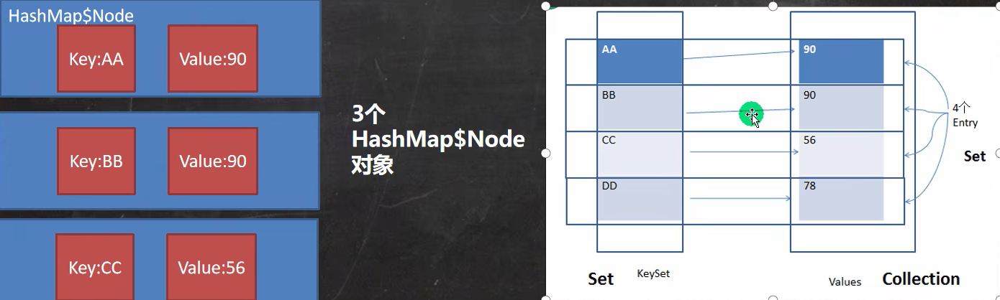

1. 集合
   1. 引出
      1. 数组的缺陷
         1. 长度开始时必须指定，一旦指定不能更改
         2. 保存的必须为同一类型元素
         3. 使用数组增加、删除元素比较麻烦
      2. 集合的概念和好处
         1. 可以动态保存任意多给对象
         2. 提供了一系列方便的操作对象的方法：add，remove，set，get
         3. 使用集合添加、删除元素更方便了
   2. 分类
      1. Collection(单列集合)
         1. List
            1. ArrayList
            2. LinkedList
            3. Vector
         2. Set
            1. HashSet
            2. TreeSet
      2. Map(双列集合，存放的是 key-value )
         1. HashMap
            1. LinkedHashMap
         2. TreeMap
         3. Hashtable
            1. Properties
   3. Collection
      1. public interface Collection<E> extends Iterable<E>
      2. collection 实现子类可以存放多个元素，每个元素可以是Object
      3. 有些 Collection 的实现类，可以存放重复的元素，有些不可以
      4. 有些 Collection 的实现类，有些是有序的(List)，有些是无序的(Set)
      5. Collection 接口没有直接的实现子类，是通过它的子接口 Set 和 List 来实现的
      6. 方法
         1. add
         2. remove
         3. contain
         4. size
         5. isEmpty
         6. clear
         7. addAll ：添加多个元素
         8. containAll
         9. removeAll
      7. 遍历
         1. 使用 iterator (迭代器)进行遍历
            1. iterator对象被称为迭代器，主要用于遍历 Collection 集合中的元素
            2. 所有实现了 Collection 接口的集合类都有一个 iterator 方法，用以返回一个实现了Iterator接口的对象，即可以返回一个迭代器
            3. Iterator 的方法
               1. hasNext
               2. next
               3. remove
            4. Iterator 仅用于遍历集合，Iterator 本身并不存放对象
            5. while快捷键 itit
         2. 增强for循环，也可以使用在数组上。快捷键 I
            ```
            Collection col = new ArrayList();
            col.add(new Book())
            for (Object book : col){
              book---
            }
            ```
   4. List
      1. 介绍
         1. List 集合中的元素有序(添加顺序和取出顺序一致)，且可重复
         2. List 集合中的每个元素都有其对应的顺序索引
         3. List 容器中的元素都对应一个整型数的序号记载其在容器中的位置，可以根据序号存取容器中的元素
         4. 常用方法
            1. add、addAll、get、indexOf、lastIndexOf、remove、set、subList
         5. 三种遍历方式
            1. 使用 iterator
            2. 使用增强for
            3. 使用普通for
      2. ArrayList 注意事项
         1. 可以添加任何元素，包括null
         2. ArrayList 是由数组实现数据存储的
         3. ArrayList 基本等同于 Vector，除了 ArrayList 是线程不安全的，但是执行效率高
         4. 底层结构和源码分析
            1. ArrayList 中维护的是一个 Object 类型的数组 elementData
               1. transition Object[] elementData
               2. transition 表示瞬间，如果被其修饰了，表示这个数据不会被序列化，直接忽略
            2. 当创建ArrayList对象时，如果使用的是无参构造器，则初始 elementData 容量为0，第一次添加，则扩容为10，如需再次扩容就扩容1.5倍
            3. 如果使用的是指定大小的构造器，则初始 elementData 容量为指定大小，如需再次扩容就扩容1.5倍
            4. IDEA 默认情况下 debug 显示的数据是简化后的，在 设置-构建、执行、部署-调试器-数据视图-Java-启用集合类的替代视图  关闭
      3. Vector
         1. 定义
            1. public class Vector<E>
            2. extends AbstractList<E>
            3. implements List<E> ,RandomAccess ,Cloneable ,Serializable
         2. Vector 底层也是一个对象数组，protected Object[] elementData;
         3. Vector 是线程同步的，即线程安全，Vector 类的操作方法带有synchronized
         4. 扩容时，如果无参就初始化为10，后续2倍扩容。如果指定大小每次直接2倍扩容
      4. LinkedList
         1. LinkedList 底层实现了双向链表和双端队列的特点
            1. 属性first、last 分别指向首节点和尾节点，size表示大小
            2. 每个节点 Node 对象，里面又维护了 prev、next、item 三个属性
            3. 所以 LinkedList 的添加删除不是通过数组完成的，相对来说效率比较高
         2. 可以添加任意元素，元素可以重复，包括 null
         3. 线程不安全，没有实现同步
         4. 增删效率高，改查效率低于 ArrayList
   5. Set
      1. 介绍
         1. 添加和取出的顺序不一致，没有索引
            1. 虽然取出的顺序不是添加的顺序，但是是固定的，不会改变
         2. 不允许重复元素，所以最多包含一个null，强制添加后会无效
         3. JDK API 中 Set 接口的实现类有：
            1. HashSet、TreeSet 等等
         4. 遍历方式
            1. 同 Collection 的遍历方式一样，因为Set接口是Collection接口的子接口
            2. 可以使用迭代器
            3. 增强for
            4. 不能使用索引的方式来获取
         5. 方法
            1. 和List接口一样，Set接口也是Collection的子接口，因此，常用方法和Collection接口一样
            2. add
      2. HashSet
         1. HashSet 实际上实现了 Set 接口
         2. HashSet 实际上是 HashMap
            1. public HashSet(){ map = new HashMap<>() }
         3. 可以存放null值，但是只能有一个
         4. HashSet 不保证元素是有序的，取决于hash后，再确定索引的结果
         5. 不能有重复元素、对象
         6. 底层机制
            1. 由于HashSet底层调用HashMap，所以其实是一个 数组+链表+红黑树 的组合
            2. 添加一个元素时，先得到hash值，会转成数组索引值
            3. 找到存储数据表table(即数组)，看这个索引位置是否已经存放的有元素
            4. 如果没有就直接加入，如果有其他元素就调用添加的类的equals方法比较，如果相同就放弃添加，如果不同就继续沿着链表往下比较，如果都不同就添加到链表最后
            6. 第一次添加时，table数组扩容到16，临界值 threshold 是16 * loadFactor = 12
               1. 如果table使用到了临界值12，就会扩容到16*2=32，新的临界值就是23，以此类推
            7. 在Java8中，如果一条链表的元素个数到达 TREEIFY_THRESHOLD(默认是8)
               1. 这时如果table大小 < MIN_TREEIFY_CAPACITY(默认64)，就会对数组进行扩容
               2. 这时如果table大小 >= MIN_TREEIFY_CAPACITY(默认64)，就会进行树化(红黑树)
      3. LinkedHashSet
         1. 底层是 LinkedHashMap(HashMap的子类)，底层维护了一个 数组(table)+双向链表
         2. LinkedHashSet 根据元素的 hashCode 值来决定元素的存储位置，同时使用链表维护元素的次序，这使得元素看起来是以插入顺序保存的
         3. LinkedHashSet 不允许添加重复元素
         4. 说明
            1. LinkedHashSet 中维护了一个hash表和双向链表，LinkedHashSet 有 head 和 tail
            2. 每一个节点有before 和 after 属性，这样可以形成双向链表
            3. 在添加一个元素时，先求hash值，再求索引，确定改元素在table的位置，然后将添加的元素加入到双向链表，如果已经存在就不添加
              ```
              示例代码
              tail.next = newElement
              newElement.pre = tail
              tail = newElement
              ```
            4. 这样的话，我们遍历LinkedHashSet也能确保插入顺序和遍历顺序一致
         5. 添加第一次时，直接将 数组table 扩容到16，存放的节点类型是 LinkedHashMap$Entry
            1. 数组是 HashMap$Node[]，存放的元素/数据是 LinkedHashMap$Entry类型
              ```
              LinkedHashMap 类下面的Entry类型
              static class Entry<K,V> extends HashMap.Node<k,V>{
                Entry<K,V> before,after;
                Entry(int hash, K key,V value,Node<K,V> next){
                  super(hash,key,value,next);
                }
              }
              ```
            2. 
   6. Map
      1. 这里讲的是JDK8的Map接口特点
      2. Map用于保存具有映射关系的数据：key-value
      3. Map中的key和value可以是任意引用类型的数据，会封装到 HashMap$Node 对象中
      4. Map 中的key不允许重复，原因和 HashSet一样。value可以重复
      5. Map中的key可以是null，value也可以是null
      6. 常用String类作为Map的key
      7. key和value之间存在单向一对一关系，即通过指定的key总能找到对应的value
      8. Map存放数据示意图，一对key-value是放在一个HashMap$Node中的，又因为Node实现了Entry接口，有些书上也说一对k-v就是一个Entry
         1. 
      9. 解读
         1. k-v 最后是 HashMap$Node = newNode(hash,key,value,null)
         2. k-v 为了方便程序员的遍历，还会创建 EntrySet 集合，该集合存放的元素的类型是 Entry，而一个Entry对象就有 k，v   
         3. EntrySet<Entry<K,V>> 即 transient Set<Map.Entry<K,V>> EntrySet;
            1. 里面存放的 key-value 指向 Node节点的key-value
         4. EntrySet 中，定义的类型是 Map.Entry，但是实际上存放的还是 HashMap$Node，这是因为 HashMap$Node implements Map.Entry
         5. 当把 HashMap$Node 对象存到 EntrySet 就方便我们的遍历
            1. K getKey();
            2. V getValue();
               ```
               Map map = new HashMap();
               Set set = map.entrySet();
               for (Object obj : set){
                // 为了从 HashMap$Node 中取到 k-v，首先需要向下转型
                Map.Entry entry = (Map.Entry) obj;
                entry.getKey() + "-" + entry.getValue()
               }
               ```
         6. 
   7. HashMap
      1. 底层机制是 数组+链表+红黑树
         1. 