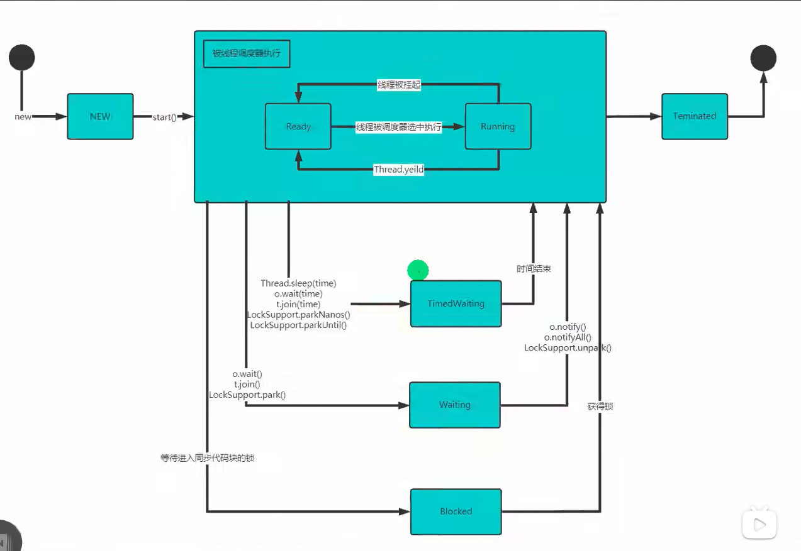

1. 泛型
   1. 引出
      1. 使用传统方法不能对加入到集合ArrayList中的数据类型进行约束
      2. 遍历的时候，需要进行类型转换，如果集合中的数据量比较大，对效率有影响
        ```
        for(Object o: arrayList){
          //向下转型
          Dog dog = (Dog) o;
        }

        //使用泛型
        ArrayList<Dog> arraylist = new ArrayList<Dog>();
        ```
         1. ArrayList<Dog> 表示存放到集合中的元素是 Dog 类型，如果编译器发现添加的类型不满足要求就会报错
         2. 在遍历的时候，可以直接取出 Dog 类型而不是 Object 类型
      3. 不适用泛型：Dog -加入-> Object -取出-> Dog
         1. 放入ArrayList会先转成Object，在取出时，还需要转换为Dog
      4. 使用泛型：Dog -> Dog -> Dog
         1. 放入时和取出时，不需要类型转换，提高效率
      5. 不再提示编译警告
   2. 泛型介绍
      1. 泛型又称参数化类型，是jdk5.0出现的新特性，解决数据类型的安全问题
      2. 在类声明或者实例化时只需要指定好需要的具体类型即可
      3. Java泛型可以保证如果程序在编译时没有发出警告，运行时就不会产生ClassCastException异常，代码更加简洁健壮
      4. 泛型的作用是：可以在类声明时通过一个标识表示类中某个属性的类型，或者是某个方法的返回值类型，或者是参数类型
   3. 语法
      1. 泛型的声明
            ```
            interface 接口<T>{}  和  class 类<K, V>{}
            ```
         1. 其中T、K、V、不代表值，而是表示类型
      2. 泛型的实例化
         1. 要在类名后面指定类型参数的值(类型)，例：
            ```
            List<String> strList = new ArrayList<String>();
            Iterator<Customer> iterator = customers.iterator()
            ```
   4. 注意事项
      1. T、K、V、只能是引用类型,即只可以使用Integer而不可以使用int
      2. 在指定泛型具体类型后，可以传入该类型或其子类类型
      3. 简写：利用编译器进行推断
          ```
          List<String> strList = new ArrayList<>();
          ```
      4. 如果没写泛型，这时默认给的泛型是 Object
   5. 自定义泛型接口
      1. 基本语法：
          ```
          interface 接口<T>{}
          ```
      2. 接口中，静态成员也不能使用泛型，这个和泛型类规定一样
          ```
          interface IUsb<U,R>{
            int a = 10;
            U name;       // 报错
          }
          ```
      3. 泛型接口的类型，在继承接口或者实现接口时确定
      4. 没有指定类型，默认为Object
   6. 自定义泛型方法
      1. 基本语法
          ```
          修饰符 <T,R>返回类型 方法名(参数列表){}
          ```
      2. 泛型方法，可以定义在普通类中，也可以定义在泛型类中
      3. 当泛型方法被调用时，类型会确定
      4. public void eat(E e){}
         1. 修饰符后没有 <T,R>eat 
         2. 方法不是泛型方法，而是使用了泛型
   7. 泛型的继承和通配符
      1. 泛型不具备继承性
          ```
          List<Object> list = new ArrayList<String>();   错误
          ```
      2. <?>:支持任意泛型类型
      3. <? extends A>：支持A类及A类的子类，规定了泛型的上限
      4. <? super A>：支持A类及A类的父类，不限于直接父类，规定了泛型的下限
   8. JUnit
      1. JUnit 是一个Java语言的单元测试框架，可以直接运行一个方法
      2. 多数Java开发环境已经集成了JUnit作为单元测试工具
      3. 使用
         1. 在方法上添加 @Test 
         2. 按 alt + enter 
         3. 选择 Add 'Junit5.4' to classpath 
2. 事件处理机制
   1. Java事件处理是采取“委派事件模型”
      1. 当事件发生时，产生事件的对象，会把此“信息”传递给“事件的监听者”处理
      2. 这里说的“信息”实际上就是java.awt.event事件类库里某个类所创建的对象，把他称为“事件的对象”
   2. 概念
      1. 事件源
         1. 事件源是一个产生事件的对象，比如按钮，窗口等
      2. 事件
         1. 事件就是承载事件源状态改变时的对象，比如当键盘事件、鼠标事件、窗口事件等等，会生成一个事件对象
         2. 该对象保存着当前事件很多信息，比如KeyEvent对象有含义被按下键的Code值
         3. java.awt.event包和java.swing.event包中定义了各种事件类型
      3. 事件监听器接口
         1. 当事件源产生一个事件,可以传送给事件监听者处理
         2. 事件监听者实际上就是一个类,该类实现了某个事件监听器接口
            1. 比如前面案例中的MyPanel就是一个类,它实现了KeyListener接口,它就可以作为一个事件监听者,对接收到的事件进行处理
         3. 事件监听器接口有多种,不同的事件监听器接口可以监听不同事件,一个类可以实现多个监听接口
         4. 这些接口在java.awt.event包和javax.awing.event包中定义
3. 线程基础
   1. 程序
      1. 是为完成特定任务,用某种语言编写的一组指令集合
   2. 进程
      1. 运行中的程序,操作系统会为该进程分配内存空间
      2. 进程是程序的一次执行过程,或是正在运行的一个程序
      3. 是动态过程,有它自身的产生,存在和消亡过程
   3. 线程
      1. 线程由进程创建的,是进程的一个实体
      2. 一个进程可以拥有多个线程
   4. 概念
      1. 单线程
         1. 同一个时刻只允许执行一个线程
      2. 多线程
         1. 同一个时刻可以执行多个线程
      3. 并发
         1. 同一个时刻，多个任务交替执行，造成一种貌似同时的错觉，简单来说，单核cpu实现的多任务就是并发
      4. 并行
         1. 同一个时刻，多个任务同时执行，多核cpu可以实现
   5. 线程使用两种方法
      1. 继承 Thread 类，重写run方法
         1. run Thread 类实现了 Runnable 接口的run方法
         2. 快捷键 ctrl + alt + t
            ```
            // main 函数
            Cat cat = new Cat();
            cat.start()

            class Cat extends Thread{
              @Override
              public void run(){
                system.out.printLn(Thread.currentThread().getName()) // 打印线程名字
              }
            }
            ```
         3. 如果在main函数中直接调用 cat.run() 方法就不会打开一个新的线程，会继续在原有的main线程执行
         4. start 方法调用 start0 方法后，改线程并不会马上执行，只是将线程变为可执行状态，具体什么时候执行由cpu统一调度
         5. start0 是本地方法，是JVM调用，底层是 c、c++ 实现
      2. 实现 Runnable 接口
         1. Java是单继承的，某些情况下一个类可能已经继承了某个父类，这时在用继承 Thread 类方法创建线程就是不可能了
         2. Java提供了通过实现 Runnable 接口来创建线程
            ```
            // main 函数
            Dog dog = new Dog();
            Thread thread = new Thread(dog)
            thread.start()

            class Dog implement runnable{
              @Override
              public void run(){
                system.out.printLn(Thread.currentThread().getName()) // 打印线程名字
              }
            }
            ```
         3. 底层使用了设计模式：代理模式
         4. 实现runnable接口方式更加适合多个线程共享同一个资源的情况，并且避免了单继承的限制
   6. 当我们启动一个进程时
      1. 首先会启动main主线程
      2. 然后main主线程会开启别的线程，这时main并不会阻塞，两个线程会同时执行
4. 线程操作
   1. 线程终止
      1. 当线程完成任务后，会自动退出
      2. 还可以通过使用变量来控制run方法退出的方式停止线程，即采用通知的方式
   2. 常用方法
      1. setName      设置线程名字
      2. getName      获取线程名字
      3. start        使线程开始执行，Java虚拟机调用start0方法
      4. run          调用线程对象的run方法
      5. setPriority  更改线程的优先级
      6. getPriority  获取线程的优先级
      7. sleep        休眠
      8. interrupt    中断线程
   3. 注意事项
      1. start底层会创建新的线程，调用run，run就是一个简单的方法调用，不会启动新的线程
      2. 线程优先级的范围
         1. MAX_PRIORITY    10
         2. MIN_PRIORITY    1
         3. MORE_PRIORITY   5  
         4. 例：t.setPriority(Thread.MIN_PRIORITY)
      3. interrupt，中断线程，但并没有真正的结束线程，所以一般用于中断正在休眠的线程
   4. 常用方法
      1. yield：线程的礼让。让出cpu，让其他线程执行，但礼让的时间不确定，所以也不一定礼让成功
      2. join：线程的插队。插队的线程一旦插队成功，则肯定先执行完插入的线程所有的任务
      3. 用户线程：也叫工作线程，当线程的任务执行完或通知方式结束
      4. 守护线程：一般是为工作线程服务的，当所有的用户线程结束，守护线程自动结束
         1. 调用方法使线程aaa变为守护线程：aaa.setDaemon(true)
      5. 常见的守护线程：垃圾回收机制
   5. 线程7大状态 Thread.State 
      1. NEW：尚未启动的线程
      2. RUNNABLE：在Java虚拟机中执行的线程，可以细化为两个状态，如图
         1. ready
         2. running
      3. BLOCKED：被阻塞等待监视器锁定的线程
      4. WAITING：正在等待另一线程执行特定动作的线程
      5. TIMED_WAITING：正在等待另一线程执行动作达到指定等待的时间的线程
      6. TERMINATED：已退出的线程
   6. 线程同步机制
      1. 在多线程编程，一些敏感数据不允许被多个线程同时访问，此时就需要使用同步访问技术，保证数据在任意时刻最多只能有一个线程在访问，以保证数据的完整性
      2. 线程同步，即当有一个线程在对内存进行操作时，其他线程都不可以对这个内存地址进行操作，直到改线程完成操作，其他线程才可以对该内存地址进行操作
      3. 方法-Synchronized
         1. 同步代码块
            1. Synchronized (对象) { 得到对象的锁，才能操作同步代码 }
         2. Synchronized 还可以放在方法声明中，表示整个方法为同步方法
            1. public Synchronized void m {String name}{ 同步代码 }
5. 锁
   1. 互斥锁
      1. Java在Java语言中，引入了对象互斥锁的概念，来保证共享数据操作的完整性
      2. 每个对象都对应于一个可被称为互斥锁的标记，这个标记用来保证在任意时刻，只能有一个线程访问该对象
      3. 关键字synchronized来与对象的互斥锁联系。当某个对象用synchronized修饰时，表明该对象在任意时刻只能由一个线程访问
      5. 同步的局限性：导致程序的执行效率要降低
      6. 同步方法（非静态的）的锁可以是this，也可以是其他对象（要求是同一个对象）
         1. 默认锁为this
      7. 同步方法（静态的）的锁为当前类本身
         1. 默认对象 当前类.class
   2. 线程死锁
      1. 多个线程都占用了对方的锁资源，但不肯让，导致了死锁，编程时一定要避免
        ```
        class DeadLock extends Thread{
          static Object o1 = new Object();
          static Object o2 = new Object();
          boolean flag;
          public void run (){
            if(flag){
              synchronized(o1){
                synchronized(o2){}
              }
            }else{
              synchronized(o2){
                synchronized(o1){}
              }
            }
          }
        }
        DeadLock A = new DeadLock(true);
        DeadLock B = new DeadLock(false);
        A.start()
        B.start()
        ```
   3. 释放锁的时机
      1. 当前线程的同步方法、同步代码块执行结束
      2. 当前线程在同步代码块、同步方法中遇到break、return
      3. 当前线程在同步代码块、同步方法中出现了未处理的Error或Exception，导致异常结束
      4. 当前线程在同步代码块、同步方法中执行了线程对象的wait()方法，让当前线程暂停，并释放锁
   4. 下面操作不会释放锁
      1. 线程执行同步代码块或同步方法时，程序调用 Thread.sleep()、Thread.yield() 方法暂停当前线程的执行，不会释放锁
      2. 线程执行同步代码块时，其他线程调用了该线程的suspend()方法将该线程挂起，该线程不会释放锁
      3. 尽量避免使用suspend()和resume()来控制线程，方法不被推荐使用
6. 