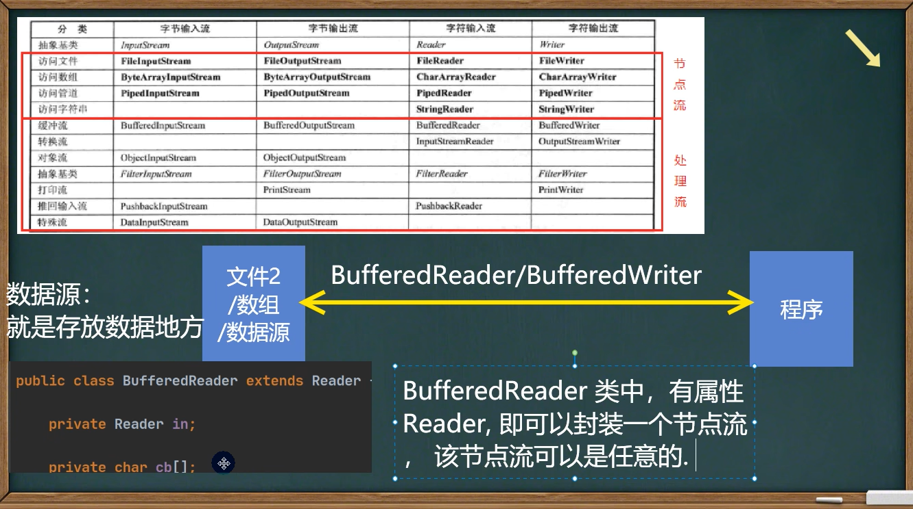

## IO流
1. 文件
   1. 文件在程序中是以流的形式来操作的
       ```
       java程序(内存)  =输出流>  文件(磁盘)
       文件(磁盘)      =输入流>  java程序(内存)
       ```
   2. 创建文件对象相关构造器
      1. File file = new File(String pathname)  // 根据路径创建一个File对象
      2. File file = new File(File parent, String child)   // 根据父目录文件+子路径构建
      3. File file = new File(String parent, String child)  // 根据父目录+子路径构建
      4. file.createNewFile 创建新文件
   3. 获取文件相关信息
      1. getName // 文件名字
      2. getAbsolutePath // 绝对路径
      3. getParent // 文件父级目录
      4. length // 文件多少字节（大小）
      5. exists // 文件是否存在
      6. isFile // 是不是一个文件
      7. isDirectory // 是不是一个目录
   4. 常用的文件操作
      1. file.mkdir：创建一级目录
      2. file.mkdirs：创建多级目录
      3. file.delete：删除空目录或文件
2. IO流原理及流的分类
   1. IO流原理 
      1. I/O是Input、Output的缩写，用于处理数据传输，如读写文件、网络通信等
      2. 在Java中，对数据的输入输出操作以流的方式进行
      3. java.io包下提供了各种流类和接口，用以获取不同种类的数据，并通过方法输入或输出数据
      4. 输入input：读取外部数据（磁盘、光盘等存储设备的数据）到程序（内存）中
      5. 输出output：将程序（内存）数据输出到磁盘、光盘等存储设备中
   2. 流的分类
      1. 按操作数据单位不同分为：字节流(8bit，用于二进制文件)、字符流(按字符，用于文本文件)
      2. 按数据流的流向不同分为：输入流、输出流
      3. 按流的角色的不同分为：字节流、处理流/包装流
         ```
                    字节流         字符流
         输入流     InputStream    Reader 
         输出流     OutputStream   Writer
         ```
         1. Java IO流共涉及40多个类，都是从上面的四个类派生的
         2. 由这四个类派生的子类名称都是以其父类名作为子类名后缀
3. 常用的类
   1. InputStream 字节输入流
      1. InputStream抽象类是所有类字节输入流的超类
      2. 常用子类如下
      3. FileInputStream：文件输入流
         1. 构造器如下
         2. FileInputStream(File file)
         3. FileInputStream(FileDescriptor fdObj)
         4. FileInputStream(String name)
         5. 方法如下
         6. close()：关闭此文件输入流并释放资源
         7. finalize()：确保不在引用文件流时调用其close方法
         8. read()：从此输入流中读取一个数据字节，如果到文件末尾返回-1
         9. read(byte[] b)：从此输入流中将最多b.length个字节的数据读入一个byte数组中
      4. BufferedInputStream extends FilterInputStream：缓冲字节输入流
      5. ObjectInputStream：对象字节输入流
   2. OutputStream 字节输出流
      1. FileOutputStream：文件输出流
         1. 构造器如下
         2. FileOutputStream(File file, boolean append) // 创建一个向指定File对象表示的文件中写入数据的文件输出流
            1. append默认是false，如果为true，则每次都会写入文件的末尾而不是覆盖
         3. 方法如下
         4. close()
         5. write() 
         6. write(byte[] b, int off, int len)
            1. str.getBytes()  字符串转为字符数组的方法
            2. off表示偏移量，len表示长度，从数组的第off个位置取len个长度的字符串写入
   3. Reader
      1. FileReader extends InputStreamReader 字符输入流
         1. 构造器如下
         2. new FileReader(File/String)
         3. 方法
         4. read：每次读取单个字符，返回该字符，如果到文件末尾返回-1
         5. read(char[])：批量读取多个字符到数组，返回读到的字符个数，如果到文件末尾返回-1
         6. new String(char[])：将 char[] 转为String
         7. new String(char[], off, len)：将 char[] 部分转为String
   4. Writer
      1. FileWriter extends OutputStreamReader 字符输出流
         1. 构造器如下
         2. new FileWriter(File/String, true):true表示追加模式
         3. write(int)：写入单个字符
         4. write(char[], off, len)：写入指定数组
         5. write(string, off, len)：写入字符串
         6. close()：等于flush+关闭，其实底层调用的还是 FileOutputStream
         7. flush()
      2. 相关API：String类： toCharArray：将String转为char[]
      3. 注意FileWriter使用后，必须要关闭close或刷新flush，否则写入不到指定的文件
4. 节点流和处理流
   1. 节点流
      1. 节点流可以从一个特定的数据源读写数据，如FileReader、FileWriter
   2. 处理流（包装流）
      1. 示意图：
      2. 是链接在已存在的流（字节流或处理流）之上，为程序提供更为强大的读写功能，如BufferedReader、BufferedWriter
   3. 区别和联系
      1. 节点流是底层流，低级流，直接和数据源相接
      2. 处理流包装节点流，既可以消除不同节点流的实现差异，也可以提供更方便的方法来完成输入输出
      3. 处理流对节点流进行包装，使用了修饰器设计模式，不会直接与数据源相连
   4. 处理流优点
      1. 性能的提高，主要以增加缓冲的方式来提高输入输出的效率
      2. 操作的便捷，处理流可能提供了一系列便捷的方法来一次输入输出大批量的数据，使用更加方便和灵活
   5. 注意事项
      1. 读写顺序需要一致
      2. 要求实现序列化或反序列化对象，需要实现 Serializable
      3. 序列化的类中建议添加 SerialVersionUID 属性，为了提高版本的兼容性
      4. 序列化对象时，默认将里面的所有属性都进行序列化，但除了static或transition修饰的成员
      5. 序列化对象时，要求里面属性的类型也需要实现序列化接口
      6. 序列化具备可继承性，也就是说如果某个类已经实现了序列化，则它的所有子类也已经默认实现了序列化
   6. 标准输入输出
       ```
                             编译类型        运行类型                 默认设备
       System.in 标准输入     InputStream    BufferedInputStream     键盘
       System.out 标准输出    PrintStream    PrintStream             显示器
       ```
5. 缓冲流
   1. BufferedReader
      1. 属于字符流，按照字符来读取数据的
      2. 关闭处理流时，只需要关闭外层流即可
      3. 使用BufferedReader读取文件可能会出现损失
          ```
          String filePath = "e:\\a.java";
          BufferedReader bf = new BufferedReader(new FileReader(filePath));
          读取
          String line;  按行读取，效率高
          while((line = BufferedReader.readLine()) != null){ 表示按行读取文件，当返回为null时，表示文件读取完毕
            sout(line);
          } 
          bf.close();  关闭流，底层自动关闭节点流
          ```
   2. BufferedWriter
      1. BufferedWriter.newLine()  插入一个和系统相关的换行符
      2. BufferedReader 和 BufferedWriter是按照字符流操作，所以不要去操作二进制文件(声音、视频、doc、pdf等)，可能会造成文件损坏
   3. BufferedInputStream
      1. 属于字节流，按照字符来读取数据的
      2. 在创建BufferedInputStream时，会创建一个内部缓冲区数组
   4. BufferedOutputStream
6.  对象流
   1. ObjectInputStream
      1. 将 Dog dog = new Dog("小黄")  这个对象保存到文件中，并且能从文件中恢复
      2. 上面就是将对象(或者基本数据类型)进行序列化和反序列化操作
      3. 序列化就是在保存数据时，保存数据的值和数据类型
      4. 反序列化就是在恢复数据时，恢复数据的值和类型
      5. 需要让某个对象支持序列化机制，则必须让其类是可序列化的，为了让某个类是可序列化的，该类必须实现如下两个接口之一：
         1. Serializable：标记接口，推荐，里面没有方法
         2. Externalizable：该接口有方法需要实现，一般不用
      6. 读取（反序列化）顺序需要和保存数据（序列化）的顺序一致
      7. 在读取Dog类时，当前包也需要有该类的定义
         1. 如果希望调用Dog类的方法，需要向下转型，同时需要将Dog类的定义拷贝到可以引用的位置
         2. 并且需要把Dog类做成共有，输入输出都引用的同一个包的Dog
         ```  
         sout(ois.readInt());
         Object dog = ois.readObject();
         sout("dog信息" + dog);

         class Dog{}
         ```
   2. ObjectOutputStream
       1. 例
         ```
         序列化后，保存的文件格式不是纯文本，而是按照它的格式来处理
         String filePath = "e:\\data.dat";
         ObjectOutputStream oos = new ObjectOutputStream(new FileOutputStream(filePath));
         序列化数据到 e:\\data.dat
         oos.writeInt(100);  int -> Integer(实现了Serializable)
         oos.writeBoolean(true);  boolean -自动装箱成包装类> Boolean(实现了Serializable)
         oos.writeUTF("字符串");  String(实现了Serializable)
         oos.writeObject(new Dog("小黄"));  
         oos.close()
         ```
7. 转换流
   1. 字节流转为字符流
      1. 默认情况下是按照utf-8读取文件，如果文件是按照别的编码方式保存，就会出现乱码
      2. 字节流是可以指定编码方式的，所以再把字节流转为字符流就可以解决问题
      3. 当处理纯文本数据时，如果使用字符流效率更高，并且可以有效解决中文问题，所以建议将字节流转为字符流
      4. 
   2. InputStreamReader
      1. Reader的子类，可以将InputStream(字节流)包转为Reader(字符流)
      2. 构造器
         1. InputStreamReader(InputStream, Charset(编码方式))
         2. 例
             ```
             String filePath = "e:\\a.txt";
             // 把字节流转为字符流，指定编码方式
             InputStreamReader isr = new InputStreamReader(new FileInputStream(filePath), "gbk");
             // 把 InputStreamReader 转为BufferedReader处理
             BufferedReader br = new BufferedReader(isr);
             // 读取
             String s = br.readLine();
             br.close();
             ```
   3. OutputStreamWriter
      1. Writer的子类，可以将OutputStream(字节流)包转为Writer(字符流)
      2. 构造器
         1. OutputStreamWriter(InputStream, Charset(编码方式))
8. 打印流
   1. 只有输入流没有输出流
   2. PrintStream 字节打印流
      1. 构造器
         1. PrintStream(OutputStream)
         2. PrintStream(String)
         3. PrintStream(File)
      2. 默认情况下，PrintStream输出数据的位置是标准输出，即显示器
         1. 因为底层使用的是write方法，所以可以直接调用write进行输出
         ```
         PrintStream out = System.out;
         out.print("hello");
         out.write("你好".getBytes());
         out.close();
         // 修改PrintStream输出数据的位置
         System.setOut(new PrintStream("e:\\a.txt"))
         ```
   3. PrintWriter
      1. 构造器
         1. PrintWriter(OutputStream)
         2. PrintWriter(String)
         3. PrintWriter(File)
      2. 例
         ```
         PrintWriter pw = new PrintWriter(System.out);
         PrintWriter pw = new PrintWriter(new FileWriter("e:\\a.txt"));
         pw.print("hello");
         pw.close;
         ```
9.  Properties类
   1. 专门用来读写配置文件的集合类
      1. 配置文件的格式： 键=值
      2. 键值对不能有空格，值不需要用引号括起来，默认类型String
   2. 常见方法
      1. load：加载配置文件的键值对到Properties对象
      2. list：将数据显示到指定设备
      3. getProperty(key)：根据键获取值
      4. setProperty(key, value)：设置键值对到Properties对象
      5. store：将properties中的键值对存储到配置文件，在idea中，保存信息到配置文件，如果含有中文，会被存储为Unicode码
   3. 示例
       ```
       Properties ppt = new Properties();
       ppt.load(new FileReader("src\\mysql.properties"));
       // 把键值对显示到控制台
       ppt.list(System.out); 
       // 把内容重新存储到新的文件夹,后面的null位置可以用来写文件首行的注释内容
       ppt.store(new FileOutputStream("src\\mysql2.properties"), null);
       ```
   4. 