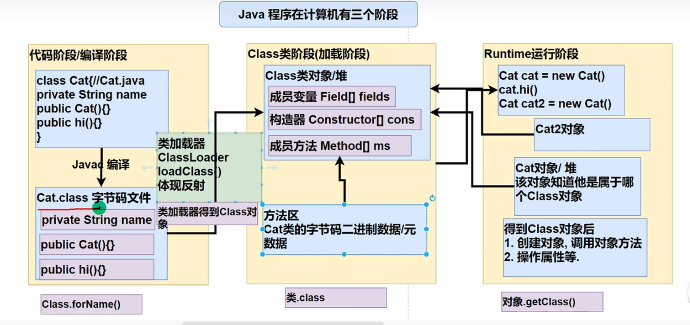

## 网络
1. 相关概念
   1. java.net包下提供了一系列的类或接口，供程序员使用，完成网络通信
   2. 网络分为三类：局域网、城域网、广域网
   3. ip地址
      1. 用于唯一标识网络中的每台计算机、主机
      2. ip地址组成：网络地址 + 主机地址，例如192.168.1.1
   4. 域名
      1. www.baidu.com
      2. 为了方便记忆，解决记ip的困难
      3. 将ip地址映射为域名
   5. 端口号
      1. 用于标识计算机上某个特定的网络程序
      2. 表示形式：整数， 0~65535 ，两个字节表示端口，0~2^16-1
      3. 0~1024 端口已经被占用，不要使用
      4. 常见的网络编程端口号
         1. tomcat 8080
         2. mysql 3306
         3. oracle 1521
         4. sqlserver 1433
   6. 网络通信协议 TCP\IP
      1. 传输控制协议、因特网互联协议，又叫网络通信协议
      2. 网络层的IP协议和传输层的TCP协议组成
      3. 在网络编程中，数据的组织形式就是协议
      4. TCP
         1. 使用TCP协议前，需要先建立TCP连接，形成传输数据通道
         2. 传输前，采用三次握手的方式，是可靠的
         3. TCP协议进行通信前的两个应用进程：客户端、服务端
         4. 在连接中进行大数据量的传输
         5. 传输完毕，释放已经建立的连接，效率低
      5. UDP
         1. 将数据、源、目的封装成数据包，不需要建立连接
         2. 每个数据包的大小限制在64k内
         3. 因无需连接，所以不可靠
         4. 发送数据结束时无需释放资源，因为不是面向连接的，速度快
2. InetAddress 类
   1. 相关方法
      1. getLocalHost：获取本机InetAddress对象
      2. getByName：根据指定主机名、域名获取InetAddress对象
      3. getHostName：通过InetAddress对象获取对应的主机名或域名
      4. getHostAddress：通过InetAddress对象获取对应的ip地址
3. Socket
   1. 基本介绍
      1. 套接字(Socket)开发网络应用程序被广泛采纳
      2. 通信两端都需要有Socket，是两台机器间通信的端点
      3. 网络通信其实就是Socket通信
      4. Socket允许程序把网络连接当成一个流，数据在两个Socket之间通过IO传输
      5. 一般主动发起通信的应用程序属于客户端，等待通信请求的是服务端
   2. 当我们需要通信时（读写数据）
      1. socket.getOutputStream()
      2. socket.getInputStream()
      3. 最后需要关闭连接 socket.close()
   3. 两种编程方式
      1. TCP网络通信编程，可靠
         1. 基于客户端-服务端的网络通信
         2. 底层使用TCP/IP协议
         3. 例：客户端发送数据，服务端接受并显示在控制台
         4. 基于Socket的TCP编程
         5. 服务端
            ```
            // 监听9999端口,等待连接 要求9999端口未被占用
            ServerSocket serverSocket = new ServerSocket(9999);
            // 当没有客户连接时，程序会阻塞；当有客户连接时，返回对象socket。可以通过accept方法返回多个Socket[多个客户端连接服务器的并发]
            Socket socket = serverSocket.accept();
            // 读取客户端发送的数据
            InputStream inputStream = socket.getInputStream();
            byte[] buf = new byte[1024];
            int readLen = 0;
            while((readLen = inputStream.read(buf)) != -1){
              sout(new String(buf, 0, readLen));
            }
            inputStream.close();
            socket.close();
            serverSocket.close();
            ```
         6. 客户端
            ```
            // 连接服务器，指定ip和端口，如果连接成功，返回socket对象
            Socket socket = new Socket(InetAddress.getLocalHost(), 9999) // 取到本机ip
            Socket socket = new Socket(168.1.1.1, 9999) //也可以是指定的ip
            //发送数据给服务端
            OutputStream outputStream = socket.getOutputStream();
            outputStream.write("hello Server".getBytes());
            // 设置写入结束标记
            // 如果是字符流也可以使用writer.newLine(),这时必须使用字符流readLine才能读取到
            // 如果是字符流,需要手动刷新，bufferedWriter.flush(); 否则数据不会写入数据通道
            socket.shutdownOutput();
            // 关闭流对象和socket
            outputStream.close()；
            socket.close();
            ```
         7. netstat指令
            1. netstat-an 可以查看当前主机网络情况，包括端口监听和网络连接情况
               1. 主要显示的内容是本机正在监听的ip和端口号(例如本机启动服务，监听8080端口)，并且显示外部连接到本机的地址
               2. Listening表示某个端口在监听
               3. 
            2. netstat-an|more 可以分页显示
               1. 要求在dos控制台下执行
         8. 当客户端连接到服务端后，实际上客户端也是通过一个端口和服务端进行通信的，这个端口通过TCP、IP来分配，是随机的
      2. UDP网络通信编程，不可靠
         1. 类 DatagramSocket 和 DatagramPacket 实现了基于 UDP 协议网络程序
         2. UDP数据包通过数据包套接字 DatagramSocket 发送和接受，系统不保证UDP数据包一定能安全的到达目的地，也不确定什么时候到达
         3. DatagramPacket 对象封装了UDP数据包，在数据包中包含了发送端的IP地址和端口号以及接收端的IP地址和端口号
         4. UDP协议中每个数据包都给出了完整的地址信息，因此无序建立发送方和接受方的连接
         5. 基本流程
            1. 建立发送端、接收端，没有明确的服务端和客户端
            2. 建立数据包，被封装在DatagramPacket中
            3. 调用DatagramSocket的发送和接受方法，可以指定在哪个端口接收数据
            4. 关闭DatagramSocket
         6. DatagramPacket构造器
            1. DatagramPacket(byte[], int, int) 接受方
            2. DatagramPacket(byte[], int, int, InetAddress, int) 发送方，指定ip地址InetAddress和端口号int
         7. 接收端A
            ```
            // 创建DatagramSocket对象，准备在9999接受数据
            DatagramSocket socket = new DatagramSocket(9999);
            // 创建DatagramPacket对象，准备接受数据
            byte[] buf = new byte[1024];
            DatagramPacket packet = new DatagramPacket(buf, buf.length)
            // 调用接受方法接受数据,将接受到的数据填充到packet对象中.如果没有数据发送过来，会阻塞
            socket.receive(packet);
            //拆包，取出数据
            int length = packet.getLength();  // 实际接收到的数据的字节长度
            byte[] data = packet.getData();
            String s = new String(data, 0, length);
            //关闭资源
            socket.close(); 
            ```
         8. 发送端B
            ```
            // 创建DatagramSocket对象，准备在8888接受数据,发送端也可以转为接收端，即一旦有人给其发送数据，也可以进行接受
            DatagramSocket socket = new DatagramSocket(8888);
            // 将需要发送的数据装包
            byte[] data = "你好".getBytes();
            DatagramPacket s = new DatagramPacket(data, 0, data.length, InetAddress.getByName("192.168.1.1"), 9999)
            //发送
            socket.send(packet);
            socket.close();
            ```
4. 反射
   1. 简介
      1. 可以通过外部文件配置，在不修改源码的情况下来控制程序
      ```
      // classfullpath 是Cat类的路径字符串
      // 加载类，返回Class类型的对象cls
      Class cls = Class.forName(classfullpath);
      // 通过cls得到加载的类 Cat 的对象实例
      Object o = cls.newInstance();
      // 通过cls得到加载的类 Cat 的methodName"hi" 的方法对象。即在反射中也可以把方法视为一个对象
      Method method1 = cls.getMethod(methodName);
      // 通过method1调用方法：
      method1.invoke(o);
      // 通过cls得到加载的类 Cat 得到成员变量，但是getField不能得到私有变量的属性
      Field name = cls.getField("name");
      sout(name.get(o)) // 打印属性的值
      // 通过cls得到加载的类 Cat 得到构造器
      // String.class 就是String类的Class对象
      Constructor constructor = cls.getConstructor(String.class); // 如果没写参数，得到的就是无参构造器
      ```
      2. 反射机制允许程序在执行期间借助Reflcection API取得任何类的内部信息，并能操作对象的属性及方法。
      3. 加载完类之后，在堆中就产生了一个class类型的对象（一个类只有一个class对象），这个对象包含了类的完整结构信息
         1. 通过这个对象得到这个类的结构，被称为反射
      4.  
         1. 反射得到的就是在加载阶段时的class类对象
      5. 功能
         1. 在运行时判断任意一个对象所属的类
         2. 在运行时判断任意一个类的对象
         3. 在运行时判断任意一个类所具有的成员变量和方法
         4. 在运行时判断任意一个对象的成员变量和方法
         5. 生成动态代理
   2. 特点
      1. 相关的主要的类
         1. java.lang.Class：代表一个类，Class对象表示某个类加载后在堆中的对象
         2. java.lang.reflect.Method：代表类的方法
         3. java.lang.reflect.Field：代表类的成员变量
         4. java.lang.reflect.Constructor：代表类的构造方法
      2. 优缺点
         1. 优点：
            1. 可以动态的创建和使用对象，也是框架底层核心，使用灵活，没有反射机制，框架技术就失去底层支撑
         2. 缺点：
            1. 使用反射基本是解释执行，对执行速度有影响
      3. 优化
         1. Method、Constructor、Field对象都有setAccessible方法
         2. setAccessible的作用是启动和禁用访问安全检查的开关
         3. 参数值为true表示 反射的对象在使用时取消访问检查，提高反射的效率。参数值为false表示反射的对象执行访问检查
   3. 细节
      1. Class类
         1. Class也是类，因此也继承Object方法
         2. Class类的对象不是new出来的，而是系统创建的 
            1. Class cls = Class.forName(classfullpath);
         3. 对于某个类的Class类对象，在内存中只有一份，因为类只加载一次
         4. 每个类的实例都会记得自己是由哪个Class实例生成的
         5. 通过Class可以完整的得到一个类的完整结构，通过一系列API
         6. Class对象是存放在堆的
         7. 类的字节码是二进制数据，是放在方法区的，有的地方称为类的元数据，包括方法代码、变量名、方法名、访问权限等等
      2. Class类常用方法
         ```
         Class cls = Class.forName(classfullpath);
         ```
         1. cls表示是哪个类的Class对象，即classfullpath路径表示的类
         2. cls.getClass：输出cls的运行类型，即java.lang.Class
         3. cls.getPackage().getName()：输出类对应的包名
         4. cls.getName()：输出全类名，和第一个相同
         5. Car car = (Car)cls.newInstance()：通过cls创建对象实例
         6. Field color = cls.getField("color")：通过反射获取属性，私有属性除外
            1. color.get(car)  // 取到car实例的属性
         7. color.set(car, "红色")：通过反射给属性赋值
         8. Field[] fields = cls.getFields()：得到所有的属性
      3. 获取Class类对象
         1. 前提：已知一个类的全类名，且该类在类路径下，可通过Class类的静态方法forName获取，可能抛出ClassNotFoundException
            1. Class cls = Class.forName("java.lang.Cat");
            2. 多用于配置文件，读取类的全路径，加载类
         2. 前提：若已知具体的类，通过类的class获取，该方式最安全可靠，程序性能最高
            1. Class cls = Car.class
            2. 多用于参数传递，比如通过反射得到对应构造器对象需要传递String，这时就需要String.class
         3. 前提：已经知道某个类的实例，调用该实例的getClass()方法获取Class对象
            1. Class class = 对象.getClass();   // 之前用的运行类型
            2. 应用场景：通过创建好的对象，获取Class对象
         4. 通过类加载器获取类的Class对象
            1. Car car = new Car()
            2. ClassLoader classLoader = car.getClass().getClassLoader(); // 得到类加载器 car
            3. Class cls = classLoader.loadClass(classAllPath);  // 通过类加载器得到Class对象
         5. 基本数据（int、char、boolean、float、double、byte、long、short）按如下方式
            1. Class cls = 基本数据类型.class
         6. 基本数据类型对应的包装类，可以通过 .type 得到Class类对象
            1. Class cls = 包装类.TYPE
      4. 哪些类型有Class对象
         1. 外部类，成员内部类，静态内部类，局部内部类，匿名内部类
         2. interface：接口
         3. 数组
         4. enum：枚举
         5. annotation：注释
         6. 基本数据类型
         7. void
      5. 类加载    
         1. 基本说明
            1. 反射机制是Java实现动态语言的关键，也就是通过反射实现类动态加载
            2. 静态加载（编译器检查）：编译时加载相关的类，如果没有则报错，依赖性太强
            3. 动态加载（使用反射）：运行时加载相关的类，如果运行时不用该类，则不报错，降低了依赖性
         2. 类加载时机
            1. 当创建对象时 （new） // 静态加载
            2. 当子类被加载时，父类也需要加载 // 静态加载
            3. 调用类中的静态成员时 // 静态加载
            4. 通过反射 // 动态加载
         3. 加载阶段 Loading
            1. JVM在该阶段的主要目的是将字节码从不同的数据源（可能是class文件，jar包，甚至网络）转化为二进制字节流加载到内存中，并生成一个代表该类的java.lang.Class对象（即Class类对象、堆）
         4. 连接阶段-验证
            1. 目的是为了确保Class文件的字节流中包含的信息符合当前虚拟机的要求，并且不会危害虚拟机自身的安全
            2. 包括：文件格式验证（是否以魔数 oxcafebabe开头）、元数据验证、字节码验证、符号引用验证
            3. 可以考虑使用 Xverify:none 参数来关闭大部分的类验证措施，缩短虚拟机的类加载时间
         5. 连接阶段-准备
            1. JVM会在该阶段对静态变量分配内存并初始化（对应数据类型的初始值，如0，0L，null，等），如果是final静态变量会直接在这里赋值，一旦赋值就不改变
            2. 这些变量所使用的内存都将在方法区中进行分配 
         6. 连接阶段-解析
            1. 虚拟机将常量池内的符号引用替换为直接引用的过程
            2. 因为编译的时候是没有内存的，每个类都是用符号表示其关系，所以这时会替换为直接引用
         7. 初始化
            1. 到初始化阶段，才真正开始执行类中定义的Java程序代码，此阶段是执行 <clinit>() 方法的过程
            2. <clinit>() 方法是由编译器按语句在源文件中出现的顺序，依次自动收集类中的所有 静态变量 的赋值动作和 静态代码块 中的语句，并进行合并
            3. 虚拟机会保证一个类的 <clinit>() 方法在多线程环境中被正确的加锁、同步，如果多个线程同时去初始化一个类，那么只会有一个类去执行这个类的 <clinit>() 方法，其他线程都需要阻塞等待，直到活动线程执行 <clinit>() 方法完毕
   4. 通过反射获取类的结构信息
      1. 第一组：java.lang.Class类
         1. getName：获取全类名
         2. getSimpleName：获取简单类名
         3. getFields：获取所有public修饰的属性，包含本类及父类
         4. getDeclaredFields：获取本类中的所有属性
         5. getMethods：获取所有public修饰的方法，包括本类及父类
         6. getDeclaredMethods：获取本类中的所有方法
         7. getConstructors：获取所有本类public修饰的构造器
         8. getDeclaredConstructors：获取所有本类中的构造器
         9.  getPackage：以Package形式返回包信息
         10. getSuperClass：以Class形式返回父类信息
         11. getInterfaces：以Class[]形式返回接口信息
         12. getAnnotations：以Annotations[]形式返回注解信息
      2. 第二组：java.lang.reflect.Field类
         1. getModifiers：以int形式返回修饰符
            1. 默认修饰符为0，public为1，private为2，protected是4，static是8，final是16
            2. 如果是public static就返回其相加的值，即9
         2. getType：以Class形式返回类型
         3. getName：返回属性名
      3. 第三组：java.lang.reflect.Method类
         1. getModifiers：以int形式返回修饰符
         2. getReturnType:以Class形式获取返回类型
         3. getName：返回方法名
         4. getParameterTypes:以Class[]返回参数类型数组
      4. 第四组：java.lang.reflect.Constructor类
         1. getModifiers：以int形式返回修饰符
         2. getName：返回构造器名（全类名）
         3. getParameterTypes:以Class[]返回参数类型数组
   5. 通过反射创建对象
      1. 调用类中的public修饰的无参构造器
      2. 调用类中的指定构造器
      3. Class类相关方法
            ```
            Class userClass = Class.forName("com.hsp.User")
            ```
         1. newInstance：调用类中的无参构造器，获取对应类的对象
            ```
            Object o = userClass.newInstance()
            ```
         2. getConstructors(Class...clazz)：根据参数列表，获取对应的public构造器对象
            ```
            // 先得到构造器
            Constructor constructor = userClass.getConstructor(String.class)
            // 再创建实例
            Object hsp = constructor.newInstance("hsp")
            ```
         3. getDecalaredConstructor(Class...clazz)：根据参数列表，获取对应的构造器对象
            ```
            // 通过非public构造器创建实例
            Constructor constructor = userClass.getDecalaredConstructor(String.class)
            constructor.setAccessible(true) // 爆破，暴力破解,使用反射可以访问private构造器
            Object hsp = constructor.newInstance("hsp")
            ```
      4. Constructor类相关方法
         1. setAccessible：爆破
         2. newInstance(Class...obj)：调用构造器
   6. 通过反射访问类中的成员
      1. 访问属性
         1. 根据属性名获取Field对象
            1. Field f = class对象.getDeclaredField(属性名)
            2. Object o = class对象.newInstance()
         2. 爆破，可以操作私有的变量
            1. f.setAccessible(true)
         3. 访问
            1. f.set(o, 值)
            2. syso(f.get(o))
            3. o表示实例对象
         4. 如果是静态属性，则set和get中的参数o，可以写成null
      2. 访问方法
         1. 根据方法名和参数列表获取Method方法对象：
            1. Method m = class对象.getDeclaredMethod(方法名，XX.class)
         2. 获取对象
            1. Object o = class对象.newInstance()
         3. 爆破
            1. m.setAccessible(true)
         4. 访问
            1. Object returnValue = m.invoke(o, 实参列表)
            2. 注意返回值的类型都是Object，而不是方法定义的返回值类型，但是运行类型还是方法定义的返回值类型
         5. 注意
            1. 如果是静态方法，则invoke的参数o，可以写成null