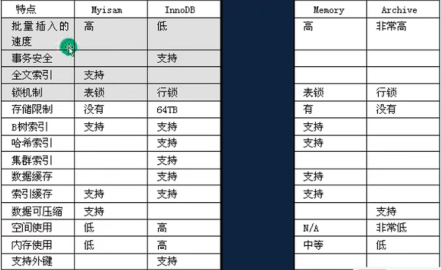
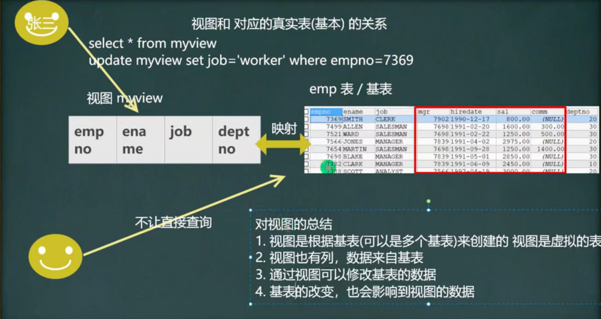
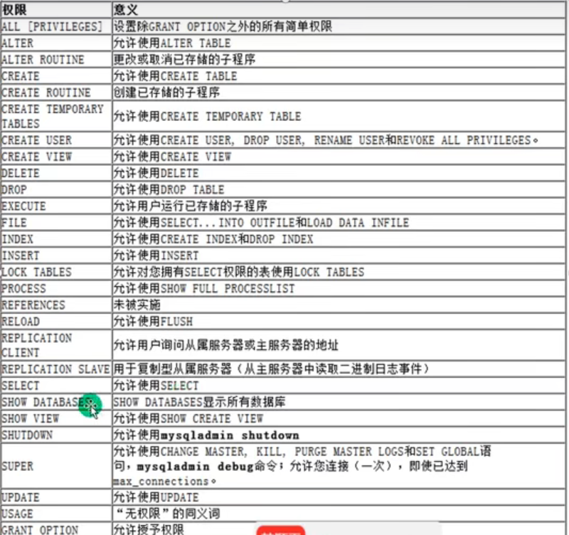

## 数据库 MySql
1. MySQL指令
   1. 服务启动关闭
      1. net start mysql
      2. net stop mysql
   2. 连接到MySQL服务的指令
      1. mysql -h 主机IP -P 端口 -u 用户名 -p密码
      2. 例：mysql -h localhost -u root -p
      3. 最后p和密码之间没有空格
      4. -p后面没写密码，回车后会要求输入密码
      5. 如果没写 -h ，默认就是本机
      6. 如果没写 -P ，默认是3306
2. 介绍
   1. 数据库的三层结构
      1. MySQL数据库就是在本机安装一个数据库管理系统（DBMS），这个管理程序可以管理多个数据库
      2. 一个数据库可以创建多个表，以保存数据
      3. 数据库管理系统、数据库和表的关系如图： 
   2. 数据在数据库中的存储方式
      1. 行和列
      2. 表的一行称为一条数据，在Java中往往对应一个对象
   3. SQL语句分类
      1. DDL:数据定义语句（create表，库）
      2. DML：数据操作语句（增加insert、修改update、删除delete）
      3. DQL：数据查询语句（select）
      4. DCL：数据控制语句（管理数据库：比如用户权限 grant revoke）
   4. 创建数据库
      ```
      CREATE DATABASE [IF NOT EXISTS] db_name [create_specification ...]
      create_specification:
        [DEFAULT] CHARACTER SET charset_name
        [DEFAULT] COLLATE collection_name

      例：CREATE DATABASE wwt_db01
      例：CREATE DATABASE wwt_db01 CHARACTER SET utf8 COLLATE utf8_general_ci
      ```
      1. CHARACTER SET：指定数据库采用的字符集，默认utf8
      2. COLLATE：指定数据库字符集的校对规则（常用的utf8_bin（区分大小写）、utf8_general_ci（不区分），默认是utf8_general_ci）
   5. 查看、删除数据库
      1. 显示数据库：SHOW DATABASES
      2. 查看数据库的定义信息：SHOW CREATE DATABASE db_name
      3. 删除数据库：DROP DATABASE [IF EXISTS] db_name
      4. 创建数据库、表的时候为了规避关键字，可以使用反引号``解决
         1. 例：CREATE DATABASE `INT`
   6. 备份恢复数据库
      1. 备份数据库（注意：在DOS执行）
         1. mysqldump -u 用户名 -p -B 数据库1 数据库2 数据库n > 文件名.sql
         2. mysqldump -u root -p -B wwt_de01 > d:\\bak.sql
         3. 这个备份文件就是对应是sql语句,也可以直接复制后执行，相当于恢复数据库了
      2. 恢复数据库（注意：进入MySQL命令行再执行）
         1. 即先执行 mysql -u root -p
         2. Source 文件名.sql
      3. 备份数据库中的表
         1. mysqldump -u 用户名 -p 数据库1 表1 表2 > 文件名.sql
3. 表相关操作
   1. 创建表
      ```
      CREATE TABLE table_name(
        field1 datatype,
        field2 datatype,
        field3 datatype,
      )character set 字符集 collate 校对规则 engine 引擎
      ```
      1. field：指定列名
      2. datatype：指定列类型（字段类型）
      3. character set：如不指定则为所在数据库字符集
      4. collate：如不指定则为所在数据库校对规则
      5. engine：引擎
      6. 注意：创建表时，要根据需保存的数据创建相应的列，并根据数据类型定义相应的列类型
   2. 常用的数据类型（列类型）
      1. 数值类型
         1. BIT（M）：位类型，M指定位数，默认1，范围1~64，显示安装bit
         2. TINYINT[UNSIGNED]：占一个字节，带符号范围是-128~127，无符号是0~255，默认有符号
         2. SMALLINT[UNSIGNED]：两个字节，带符号是-2^15 ~ 2^15-1,无符号是0 ~ 2^16-1
         2. MEDIUMINT[UNSIGNED]：三个字节，带符号是-2^23 ~ 2^23-1,无符号是0 ~ 2^24-1
         2. INT[UNSIGNED]：四个字节，带符号是-2^31 ~ 2^31-1,无符号是0 ~ 2^32-1
         3. BIGINT[UNSIGNED]：八个字节，带符号是-2^63 ~ 2^63-1,无符号是0 ~ 2^64-1
         4. FLOAT[UNSIGNED]：四个字节
         5. DOUBLE[UNSIGNED]：表示比float精度更大的小数，八个字节
         6. DECIMAL(M,D)[UNSIGNED]：定点数M是小数位数的总和，D表示小数点后面的位数。如果D省略默认是0，M省略默认是10.M最大65，D最大30
      2. 文本、二进制类型
         1. CHAR(size) char(20)：固定长度字符串，最大255字符
         2. VARCHAR(size) varchar(20)：可变长度字符串，0~65535（2^16 - 1）字节，utf8编码最大21844字符，其中1~3个字节用于记录字段大小
         3. 细节
            1. 字符长度
               1. char(4) 这个4表示的是字符数，最大255，不是字节数，不管中文还是字母都是4个，按字符计算
               2. varchar(4) 这个4表示的是字符数，不是字节数，不管中文还是字母都以定义好的表的编码来存放数据
               3. 不管是中文还是字母，都是最多存放四个，按照字符存放的
            2. 字符占用空间
               1. char(4)是定长，即使插入的是'a'，也会占用全部空间4个字符
               2. varchar(4)是变长，按照实际占用空间来分配，例如'a'占用的是a字符的大小另加1-3个字节（记录存放的内容长度）
            3. 如何挑选
               1. 如果数据是定长，推荐使用char，比如md5的密码，邮编，手机号等
               2. 如果字段的长度不确定，使用varchar
               3. char的查询速度大于varchar
            4. text
               1. 存放文本时，可以使用TEXT数据类型，相当于VARCHAR列
               2. 注意text没有默认值，大小 0-2^16字节
               3. 可以使用MEDIUMTEXT 0-2^24 LONGTEXT 0-2^32
         4. BLOB LONGBLOB：二进制数据 BLOB 0 ~ 2^16-1 LONGBLOB 0 ~ 2^32-1
         5. TEXT LONGTEXT：文本TEXT 0 ~ 2^16  LONGTEXT 0 ~ 2^32
      3. 时间日期
         1. DATE/DATETIME/TIMESTAMP：日期类型(YYYY-MM-DD) (YYYY-MM-DD HH:MM:SS)。timestamp表示时间戳，用于自动记录inset、update的时间
            ```
            CREATE TABLE table1(
              t1 DATE, t2 DATETIME, t3 TIMESTAMP 
              NOT NULL DEFAULT CURRENT_TIMESTAMP 
              ON UPDATE CURRENT_TIMESTAMP // 默认是当前时间戳，修改的时候也是以当前的时间戳来更新
            )
            ```
   3. 修改表
      1. 添加修改删除列
         1. 添加列
            1. ALTER TABLE tablename ADD (column datatype [DEFAULT expr]...)
            1. ALTER TABLE emp ADD image VARCHAR(32) NOT NULL DEFAULT '' AFTER RESUME  // 最后表示在resume字段的后面添加image字段
         2. 修改列
            1. ALTER TABLE tablename MODIFY (column datatype [DEFAULT expr]...)
         3. 删除列
            1. ALTER TABLE tablename DROP (column datatype [DEFAULT expr]...)
         4. 查看表所有的列
            1. DESC 表名
         5. 修改表名
            1. Rename TABLE 表名 TO 新表名
         6. 修改表的字符集
            1. ALTER TABLE 表名 CHARACTER SET 字符集
         7. 修改列名
            1. ALTER TABLE 表名 CHANGE 列名 新列名 VARCHAR(32) NOT NULL DEFAULT ''
   4. 数据库CRUD语句
      1. Insert 添加数据
         1. INSERST INTO table_name (column ...) VALUES (value ...),(value ...)
         2. 字符和日期类型数据应该包含在单引号中
         3. 如果某个列没有指定not null，那就可以插入空null值，如果不写默认null
         4. 如果是给所有字段添加数据，可以不写前面的列字段名称
      2. Update 更新数据
         1. UPDATE table_name SET col_name=expr1 WHERE where_defination
         2. UPDATE employee SET salary = 5000 WHERE user_name = '小王'
         3. WHERE语句指定更新的是哪些行，如果没有那么更新所有的数据
      3. Delete 删除数据
         1. DELETE FROM table_name WHERE where_defination
         2. delete不能删除某一列的值
         3. delete只能删除表的记录，不能删除表本身，使用drop table可以删除表
      4. Select 查找数据
         1. 语法
            1. SELECT [DISTINCT ] *|{column1, column2...} FROM table_name
            2. DISTINCT可选，表示是否去除查询结果中完全相同的重复数据
         2. 使用表达式对查询的列进行计算
            1. SELECT *|{column1 | expresstion, column2 | expresstion...} FROM table_name
         3. 使用as语句
            1. SELECT columnname AS 别名 FROM 表名
            2. SELECT `name` AS '名字', (chinese + math + 10) AS total_score FROM student
         4. where语句常用的运算符
            1. 比较运算符
               1. < > = != ：大于小于不等于
               2. BETWEEN AND：显示在某一区间的值，闭区间
               3. IN(set)：显示在in列表中的值，例in(100,200)
               4. LIKE / NOT LIKE：模糊查询
                  1. % 表示0到多个任意字符
                  2. _ 表示单个字符
               5. IS NULL：判断是否为空
            2. 逻辑运算符
               1. and：多个条件同时成立
               2. or：多个条件任一成立
               3. not：不成立
         5. 使用 order by 子句排序查询结果
            1. SELECT column1, coumun2... FROM table_name ORDER BY column ASC|DESC, ...
            2. order by指定排序的列，排序的列既可以是表中的列名，也可以是select语句后指定的列名
            3. asc 升序 desc 降序
            4. order by语句位于select语句的结尾
         6. 合计、统计函数 
            1. count
               1. SELECT COUNT(*)|count(列名) FROM tablename [where ...]
               2. 返回行的总数
               3. COUNT(*)：返回满足条件的记录的行数
               4. COUNT(列名)：统计满足条件的某列有多少个，但是会排除为null的
            2. sum
               1. SELECT SUM(列名),sum(列名)... FROM tablename [where ...]
               2. SUM函数返回满足where条件的行的和
            3. avg
               1. SELECT AVG(列名),AVG(列名)... FROM tablename [where ...]
               2. AVG函数返回满足WHERE条件的一列的平均值
            4. max、min  
               1. SELECT MAX(列名),MAX(列名)... FROM tablename [where ...]
               2. 返回满足WHERE条件的一列的最大、最小值
         7. 分组统计
            1. group by
               1. SELECT column1,column2... FROM tablename GROUP BY column HAVING ...
               2. group by用于对查询的结果分组统计
            2. having子句用于过滤分组显示结果
   5. 函数
      1. 字符串相关函数
         1. CHARSET(str)：返回字符串使用的字符集
            1. SELECT CHARSET(ename) FROM tablename
         2. CONCAT(string2 ...)：连接字符串，将多列拼为一列
         3. INSTR(string, substring)：返回substring在string中出现的位置，没有返回0
         4. UCASE(string2)：转换成大写
         5. LCASE(string2)：转换成小写
         6. LEFT(string2, length)：从string2中的左边起去length个字符
         7. LENGTH(string)：string的长度
         8. REPLACE(str, search_str, replace_str)：在str中用replace_str替换search_str
         9.  STRCMP(string1, string2)：逐字符比较两个字符串大小
         10. SUBSTRING(str, position, length)：从str的position开始，取length个字符
         11. LTRIM(string2) RTRIM(string2) TRIM(string2)：去除空格
      2. 数学函数
         1. ABS(num)：绝对值
         2. BIN(decimal_number)：十进制转二进制
         3. CEILING(number2)：向上取整
         4. CONV(number2, from_base, to_base)：进制转换
         5. FLOOR(number2)：向下取整
         6. FORMAT(number, decimal_places)：保留小数位数，四舍五入
         7. HEX(DecimalNumber)：转十六进制
         8. LEAST(number, number2...)：求最小值
         9. MOD(numerator, denominator)：求余
         10. RAND([seed ])：范围为[0, 1.0]
      3. 日期函数
         1. CURRENT_DATE()：当前日期
         2. CURRENT_TIME()：当前时间
         3. CURRENT_TIMESTAMP()：当前时间戳
         4. DATE(datetime)：返回datetime的日期部分
         5. DATE_ADD(date2, INTERVAL d_value d_type)：在date2加上时间或日期
            1. 例：SELETE * FROM mes WHERE DATE_ADD(send_time, INTERVAL 10 MINUTE) >= NOW()  // 查询十分钟内的数据
            2. d_value 可以是YEAR\MINUTE\SECOND\DAY\HOUR等
            3. d_type
         6. DATE_SUB(date2, INTERVAL d_value d_type)：在date2减去时间或日期
         7. DATEDIFF(date1, date2)：两个日期差，date1-date2,结果是天
         8. TIMEDIFF(date1, date2)：两个日期差，结果是时分秒
         9. NOW()：当前时间
         10. YEAR|MONTH|DATE(datetime) FROM_UNIXTIME() UNIX_TIMESTAMP()：年月日
             1. 例：SELETE YEAR(NOW()) FROM DUAL  // 得到当前年，DUAL就是一个展示用的table，系统提供的
             2. 例：SELETE UNIX_TIMESTAMP() FROM DUAL  // 得到1970-1-1到现在的秒数
             3. 例：SELETE FROM_UNIXTIME(1314256346, '%Y-%m-%d %H:%i:%s') FROM DUAL  // 把一个UNIX_TIMESTAMP秒数转为指定格式的日期
      4. 加密函数
         1. USER()：查询用户
         2. DATABASE()：数据库名称
         3. MD5(str)：为字符串算出一个MD5 32的字符串，常用（用户加密）密码
         4. PASSWORD(str)：从原文密码str计算并返回密码字符串，通常用于对mysql数据库的用户密码加密
      5. 流程控制函数
         1. IF(expr1, expr2, expr3)：如果expr1为true，则返回expr2，否则返回expr3
            1. 例：SELECT ename, IF(comm IS NULL, 0.0, comm) FROM emp  //emp中的comm字段如果是null就返回0.0，对于null，需要使用IS判断
            2. 例：SELECT ename, IFNULL(comm , 0.0) FROM emp  //emp中的comm字段如果是null就返回0.0
         2. IFNULL(expr1, expr2)：如果expr1不为空null，则返回expr1，否则返回expr2
         3. SELECT CASE WHEN expr1 THEN expr2 WHEN expr3 THEN expr4 ELSE expr5 END：如果expr1为true，则返回expr2，如果expr3为true，则返回expr4，否则返回expr5
            ```
            SELECT ename, (
              SELECT CASE 
                WHEN job = 'CLERK' THEN '职员'
                WHEN job = 'MANAGER' THEN '经理'
                ELSE job END
            ) FROM emp
            ```
4. 多表查询
   1. mysql表查询--加强
      1. 分页查询
         1. SELECT ... LIMIT start,rows   //表示从start+1行开始取，去除rows行，start从0开始计算
      2. 顺序问题
         1. group by
         2. having
         3. order by 
         4. limit
   2. 默认情况下，当两个表查询时，规则如下
      1. 从第一张表中取出一行，和第二张表的每一行记录进行拼接组合，包含两张表的所有列
      2. 返回结果称为笛卡尔集
      3. 例：SELECT ename,sal,dname FROM emp,dept WHERE emp.deptno = dept.deptno
   3. 自连接
      1. 在同一个表的连接查询，将一张表看为两张表
      2. 例：SELECT * FROM emp worker,emp boss
      3. 把emp表取了两个别名 worker和boss
   4. 子查询
      1. 嵌入在其他sql语句中的select语句，也叫嵌套查询
          ```
          查询和SMITH同一部门的员工
          SELECT * FROM emp WHERE job IN (
            SELECT deptno FROM emp WHERE deptno = 10
          ) AND deptno != 10
          ```
      2. 单行子查询：只返回一行数据的子查询语句
      3. 多行子查询：返回多行数据的子查询，使用关键字 in
      4. 子查询也可以当作临时表使用
      5. all操作符
         1. WHERE sal>ALL(SELECT sal FROM emp WHERE deptno = 10)
         2. 表示比所有的数据中的每一个都要大
      6. any操作符
         1. 表示比数据中的一个大就可以
      7. 多列子查询：返回多个列数据的子查询
         1. where (字段1， 字段2...) = (select 字段1， 字段2... from ...)
   5. 表复制和去重
      1. 自我复制数据（蠕虫复制）
         1. 进行sql测试效率时需要海量数据，这时可以使用其创建数据
         2. 把emp表的数据复制到 my_tab01
            1. INSERT INTO  my_tab01 (id, name,sal,job,deptno)   SELECT empno,name,sal,job,deptno FROM emp
         3. 自我复制
            1. INSERT INTO  my_tab01 SELECT * FROM my_tab01
      2. 删除表中重复数据
         1. 创建表my_tab02
            1. CREATE TABLE my_tab02 LIKE emp   // 创建emp表的结构复制到my_tab02表
         2. 添加数据
            1. INSERT INTO  my_tab02 SELECT * FROM emp
         3. 去重
            1. 创建临时表tmp
               1. CREATE TABLE tmp LIKE my_tab02
            2. 把my_tab02通过distinct处理复制到tmp表
               1. INSERT INTO emp SELECT DISTINCT * FROM my_tab02
            3. 清除表my_tab02
               1. DELETE FROM my_tab02
            4. 把tmp表复制到my_tab02
               1. INSERT INTO my_tab02 SELECT * FROM emp 
            5. 删掉表tmp
               1. DROP TABLE emp
   6. 合并查询
      1. 合并多个select语句的结果，这时可以使用集合操作符号 union，union all
      2. union all：取得两个结果集的并集。当使用该操作符时，不会去除重复行
      3. union:会去除重复行
         1. SELETE job FROM emp WHERE sal>500 UNION SELETE job FROM emp WHERE job='MANAGE' 
   7. 外连接
      1. SELECT name,stu.id FROM stu,exam WHERE stu.id=exam.id 正常多表查询
      2. 左外连接：如果左侧的表完全显示，就是左外连接（即使左边的表存在和右边的表没有匹配的行也显示）
         1. SELECT ... FROM 表1 LEFT JOIN 表2 ON 条件
         2. SELECT name,stu.id FROM stu LEFT JOIN exam ON stu.id=exam.id 
      3. 右外连接：如果右侧的表完全显示，就是右外连接
         1. SELECT ... FROM 表1 RIGHT JOIN 表2 ON 条件
   8. 约束
      1. 确保数据库的数据满足特定的商业规则
      2. 包括
         1. not null
         2. unique
            1. 定义了之后该列不能重复
            2. 如果没有指定not null，则unique字段可以有多个null
            3. 一张表可以有多个unique字段
         3. primary key
            1. 字段名 字段类型 primary key
            2. 也可以直接在表定义最后写 primary key(列名) ，也就是复合主键的使用情况
            3. 用于唯一标识表行的数据，当定义主键约束后，该列不能重复且不能为null
            4. 一张表只能有一个主键，但是可以是复合主键（例：PRIMARY KEY (id, name)）
         4. foreign key
            1. 用于定义主表和从表之间的关系：外键约束要定义在从表上，外键指向的主表字段则必须是主键约束或unique约束
            2. 当定义外键约束后，要求外键列数据必须在主表的主键列存在或为null
            3. FOREIGN KEY (本表字段名) REFERENCES 主表名(主键名或unique字段名)
              ```
              CREATE TABLE my_class(
                id INT PRIMARY KEY,
              )

              CREATE TABLE my_stu(
                id INT PRIMARY KEY,
                class_id INT,
                FOREIGN KEY (class_id) REFERENCES my_class(id)
              )
              ```
            4. 表的引擎类型是innodb，这样的表才支持外键
            5. 外键字段的类型要求和主键字段的类型一致，长度可以不同
            6. 一旦建立外键关系，主表的数据就不能随便删除了
         5. check
            1. 用于强制行数据必须满足的条件，假定在sal列上定义了check约束，并要求sal列值在1000~2000之间，如果不在这区间就会报错
            2. 语法：列名 类型 CHECK (CHECK条件)
            3. sex VARCHAR(6) CHECK (sex IN('man', 'woman'))
            4. mysql5.7目前还不支持，oricle和sql server支持
   9. 自增长
      1. 添加记录时，某一列从1开始可以自动增长
         1. 字段名 整型 primary key auto_increament
      2. 添加自增长字段
         1. insert into xxx(字段1，字段2...) values (null, 值2...)
            1. 字段1对应的values是null，如果这个字段设置为自增长，那么就可以自动添加值
         2. insert into xxx(字段2...) values (值2...)
            1. 第二种方式就是直接不给字段1添加值实现自增长
      3. 一般来说自增长是和主键配合使用
      4. 自增长也可以单独使用，但是需要配合一个unique
      5. 自增长修饰的字段为整型的，虽然小数也可以但是不这样用
      6. 默认从1开始，也可以修改
         1. alter table 表名 auto_increment = 新的开始值
5. 索引
   1. 可以提高数据库性能，不用加内存，不用改程序，不用调sql，就可以提高查询速度
      1. CREATE INDEX empno_index ON emp (empno)
      2. 创建了索引后，只对创建了索引的列查询有效，即empno列
   2. 原理 
      1. 当没有索引时，会进行全表扫描，查询速度很慢
      2. 如果对某一列创建了索引，会对其生成一个二叉树
      3. 代价
         1. 磁盘占用
         2. 对dml(update delete insert)语句效率有影响
   3. 类型
      1. 主键索引，主键自动的为主索引（类型primary key）
      2. 唯一索引（unique），含有unique的字段自动变为唯一索引
      3. 普通索引（index）
      4. 全文索引（fulltext）
         1. 比如想从一篇文章中搜索‘电影’这个单词，就可以使用全文索引，但是MySQL的全文索引效率低，很少用
         2. 一般使用全文搜索Solr和ElasticSearch
   4. 语法
      1. 查询表是否有索引
         1. SHOW INDEX FROM 表名
         1. SHOW INDEXES FROM 表名
         1. SHOW KEYS FROM 表名
      2. 添加索引
         1. CREATE UNIQUE INDEX index_name on table_name(id) //添加唯一索引
         2. CREATE INDEX index_name on table_name(id) //添加普通索引
         3. ALTER TABLE table_name ADD INDEX index_name(id) //添加普通索引
      3. 添加主键（索引）
         1. ALTER TABLE table_name ADD PRIMARY KEY(列名...) 
      4. 删除索引
         1. DROP INDEX index_name ON table_name
         2. alter table table_name drop index index_name
      5. 删除主键索引
         1. alter table table_name drop primary key 
      6. 修改索引：先删除再添加新的索引
   5. 使用
      1. 频繁的作为查询条件适合作为索引
      2. 唯一性太差的字段不适合单独创建索引
      3. 更新频繁的字段不适合作为索引
      4. 不会出现在where子句中的字段不该创建索引
6. 事务
   1. 介绍
      1. 事务用于保证数据的一致性，他是由一组相关的dml语句（增删改）组成，改组的dml语句要么全部成功要么全部失败
      2. 例如转账就需要用事务来处理，保证数据的一致性
      3. 事务和锁
         1. 当执行事务操作时，mysql会在表上加锁，防止其他用户修改表的数据
      4. mysql数据库控制台事务的几个重要操作
         1. start transition  --开始一个事务，也可以使用 set autocommit=off
         2. savepoint 保存点名  --设置保存点
         3. rollback to 保存点名  --回退事务
         4. rollback  --回退全部事务
         5. commit --提交事务，所有的操作生效，不能回退
            1. 当执行commit后，会确认事务的变化，结束事务，删除保存点，释放锁，数据生效，其他会话可以查看到事务变化后的新数据，数据就正式生效
            2. 因为数据库是由很多连接组成的，一旦正式生效，其他人也就可以查看到
   2. 细节
      1. 如果不开始事务，默认情况下，dml操作是自动提交的，不能回滚
      2. mysql 的事务机制需要innodb的存储引擎才可以使用，myisam不好使
   3. 事务的四种隔离级别
      1. 隔离级别
         1. 多个连接开启各自事务操作数据库中的数据时（例某个连接在进行dml操作，另一个连接在查看数据库），数据库系统要负责隔离操作，以保证各个连接在获取数据时的准确性
         2. 如果不考虑准确性，会发生以下问题
            1. 脏读：当一个事务读取另一个事务尚未提交的修改时
            2. 不可重复读：同一查询在同一事物中多次进行，由于其他提交事务所做的修改或删除，每次返回不同的结果集
            3. 幻读：同意查询在同一事物中多次进行，由于其他提交事务所作的插入动作，每次返回不同的结果集
      2. 事务隔离级别
         1. mysql隔离级别定义了事务与事务之间的隔离程度
            ```
            事务隔离级别                    脏读    不可重复读      幻读     加锁读
            读未提交(Read uncommitted)       T         T            T      不加锁 
            读已提交(Read committed)         F         T            T      不加锁
            可重复读(Repeatable read)        F         F            F      不加锁
            可串行化(Serializable)           F         F            F      加锁
            ```
         2. 加锁标识如果操作当前的数据库时，同时还有别人在操作，就会卡住等待对方commit之后才继续执行
      3. 操作
         1. 查看当前会话隔离级别
            1. SELECT @@tx_isolation
         2. 查看系统当前隔离级别
            1. SELECT @@global.tx_isolation
         3. 设置当前会话隔离级别
            1. set session transaction isolation level repeatable read
         4. 设置系统当前隔离级别
            1. set global transaction isolation level repeatable read
         5. mysql默认的事务隔离级别是 repeatable read，一般情况下，没有特殊要求，没必要修改
         6. 全局修改，修改my.ini配置文件
            ```
            [mysql]
            transaction-isolation = REPEATABLE-READ
            ```
   4. ACID特性
      1. 原子性 atomicity
         1. 事务是一个不可分割的工作单位，事务中的操作要么都发生要么都不发生
      2. 一致性 consistency
         1. 事务必须使数据库从一个一致性状态转为另一个一致性状态
      3. 隔离性 isolation
         1. 事务的隔离性是多个用户并发访问数据库时，数据库为每一个用户开启的事务，不能被其他事务的操作数据所干扰，多个并发事务之间要相互隔离
      4. 持久性 durability
         1. 一个事务一旦被提交，他对数据库中的数据改变就是永久性的，接下来即使数据库发生故障也不会对其有任何影响
7. 存储引擎
   1. 基本介绍
      1. MySQL的表类型由存储引擎决定，主要包括myisam，innodb，memory等
      2. MySQL数据表主要支持六种类型，分别是CSV,Memory,ARCHIVE,MRG_MYISAM,MYISAM,InnoBDB
      3. 这六类又分为两类，一类是 “事务安全型”，比如innodb，其余都是第二类，“非事务安全型”
   2. 主要的存储引擎/表类型特点  
      1. MyISAM不支持事务、也不支持外键，但其访问速度快，对事务的完整性没有要求
      2. InnoDB提供了具有提交、回滚和崩溃恢复能力的事务安全。但是比myisam存储效率差一些并且会占用更多的磁盘空间以保留数据和索引
      3. MEMORY使用存在内存中的内容来创建表。每个memory表只实际对应一个磁盘文件。memory类型的表访问非常快，因为其数据是放在内存中的，并且默认使用HASH索引，但是一旦服务关闭，表中的数据就会丢失掉，表的结构还在
   3. 如何选择
      1. 如果引用不需要事务，处理的只是基本的CRUD操作，那么myisam比较合适，速度快
      2. 如果需要事务支持，innodb
      3. memory引擎所作的任何修改在服务器重启后都将消失
   4. 修改存储引擎
      1. ALTER TABLE `表名` ENGINE = 存储引擎
8. 视图
   1. 基本概念
      1. 视图是一个虚拟表，其内容由查询定义。同真实的表一样，视图包含列，其数据来自真实的表（基表）
      2. 视图和表之间关系的示意图  
      3. 通过视图可以修改基表的数据
      4. 基表的改变，也会影响到视图的数据
   2. 基本使用
      1. create view 视图名 as select语句   --创建
      1. alter view 视图名 as select语句   --更新成新的视图
      1. show create view 视图名   --查看创建视图的指令
      1. drop view 视图名1,视图名2   --删除
   3. 细节
      1. 创建视图后，到数据库查看，对应视图只有一个视图结构文件   视图名.frm
      2. 视图中可以再次使用视图
   4. 最佳实践
      1. 安全：表中某些字段数据是保密的，不能让用户看到
      2. 性能：关系数据库的数据常常会分表存储，使用外键建立这些表之间的关系
         1. 这时数据库查询通常会用到连接 JOIN ，这样麻烦且效率低，就可以使用视图把相关的表和字段组合在一起
      3. 灵活：如果系统有一个旧表即将废弃，但是很多应用都是基于这张表，不易修改
         1. 这时就可以建立一张视图，视图中的数据映射到新建的表
9. MySQL管理
   1. mysql用户管理
      1. mysql中的用户，都存储在系统数据库mysql中的user表里
      2. user表中的一些字段说明
         1. host：允许登录的位置，localhost表示只允许该用户本机登录，也可以指定ip地址
         2. user：用户名
         3. authentication_string：密码，是通过mysql的password（）函数加密之后的密码
      3. 创建用户
         1. create user '用户名' @'允许登录的位置' identified by '密码'
      4. 删除用户
         1. drop user '用户名' @'允许登录的位置'
      5. 用户修改密码
         1. 修改自己的密码
            1. set password=password('密码')
         2. 修改别人的密码（需要有修改用户密码权限）
            1. set password for '用户名'@'登录位置' = password('密码')
   2. mysql的权限管理
      1. 不同的数据库用户，操作的库和表不相同，因为权限不一样
         1.  
      2. 给用户授权
         1. grant 权限列表 on 库.对象名 to '用户名' @'登录位置' 【identified by '密码'】
      3. 权限列表，多个权限用逗号分开
         1. grant select on ......
         2. grant select, delete, create on ......
         3. gtant all [privileges ] on ......  //表示赋予该用户在该对象上的所有权限
      4. 特别说明，授权语法中的 库.对象名 如果是下面两种情况
         1. *.* :代表本系统中的所有数据库的所有对象（表、视图、存储过程）
         2. 库.* :表示某个数据库中的所有数据对象（表、视图、存储过程）
      5. identified by可以省略，也可以写出，如果写上了，下面两种情况
         1. 如果用户存在，就是修改该用户的密码
         2. 如果该用户不存在，就是创建该用户
      6. 回收用户权限
         1. revoke 权限列表 on 库.对象名 from '用户名'@'登录位置'
      7. 权限生效指令
         1. 如果权限没有生效，可以执行下面命令
         2. FLUSH PRIVILEGES
   3. 细节
      1. 创建用户时，如果不指定host，则为%，%表示所有的IP都有权限连接。create user xxx
      2. 也可以 create user 'xxx'@'192.168.1.%' 表示xxx用户在192.168.1.*的ip可以登录mysql
      3. 删除用户的时候，如果host不是%，需要明确指定'用户'@'host值'