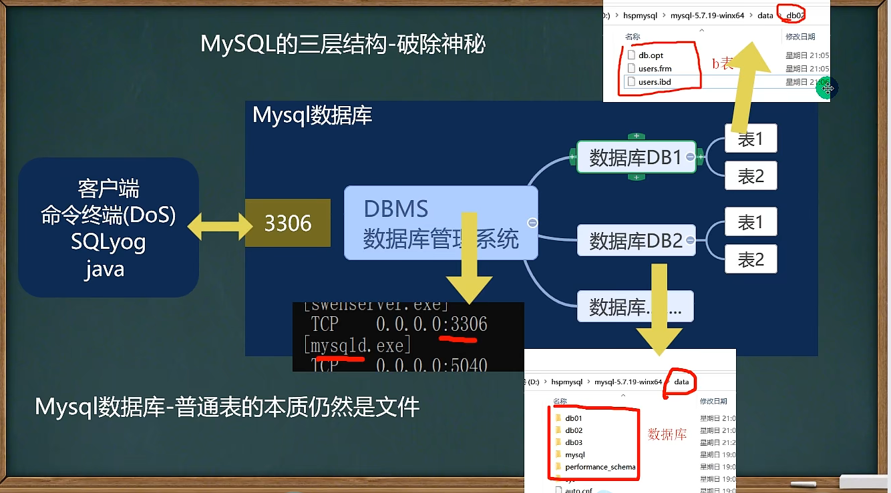

## 数据库 MySql
1. MySQL指令
   1. 服务启动关闭
      1. net start mysql
      2. net stop mysql
   2. 连接到MySQL服务的指令
      1. mysql -h 主机IP -P 端口 -u 用户名 -p密码
      2. 例：mysql -h localhost -u root -p
      3. 最后p和密码之间没有空格
      4. -p后面没写密码，回车后会要求输入密码
      5. 如果没写 -h ，默认就是本机
      6. 如果没写 -P ，默认是3306
2. 介绍
   1. 数据库的三层结构
      1. MySQL数据库就是在本机安装一个数据库管理系统（DBMS），这个管理程序可以管理多个数据库
      2. 一个数据库可以创建多个表，以保存数据
      3. 数据库管理系统、数据库和表的关系如图： 
   2. 数据在数据库中的存储方式
      1. 行和列
      2. 表的一行称为一条数据，在Java中往往对应一个对象
   3. SQL语句分类
      1. DDL:数据定义语句（create表，库）
      2. DML：数据操作语句（增加insert、修改update、删除delete）
      3. DQL：数据查询语句（select）
      4. DCL：数据控制语句（管理数据库：比如用户权限 grant revoke）
   4. 创建数据库
      ```
      CREATE DATABASE [IF NOT EXISTS] db_name [create_specification ...]
      create_specification:
        [DEFAULT] CHARACTER SET charset_name
        [DEFAULT] COLLATE collection_name

      例：CREATE DATABASE wwt_db01
      例：CREATE DATABASE wwt_db01 CHARACTER SET utf8 COLLATE utf8_general_ci
      ```
      1. CHARACTER SET：指定数据库采用的字符集，默认utf8
      2. COLLATE：指定数据库字符集的校对规则（常用的utf8_bin（区分大小写）、utf8_general_ci（不区分），默认是utf8_general_ci）
   5. 查看、删除数据库
      1. 显示数据库：SHOW DATABASES
      2. 查看数据库的定义信息：SHOW CREATE DATABASE db_name
      3. 删除数据库：DROP DATABASE [IF EXISTS] db_name
      4. 创建数据库、表的时候为了规避关键字，可以使用反引号``解决
         1. 例：CREATE DATABASE `INT`
   6. 备份恢复数据库
      1. 备份数据库（注意：在DOS执行）
         1. mysqldump -u 用户名 -p -B 数据库1 数据库2 数据库n > 文件名.sql
         2. mysqldump -u root -p -B wwt_de01 > d:\\bak.sql
         3. 这个备份文件就是对应是sql语句,也可以直接复制后执行，相当于恢复数据库了
      2. 恢复数据库（注意：进入MySQL命令行再执行）
         1. 即先执行 mysql -u root -p
         2. Source 文件名.sql
      3. 备份数据库中的表
         1. mysqldump -u 用户名 -p 数据库1 表1 表2 > 文件名.sql
3. 表相关操作
   1. 创建表
      ```
      CREATE TABLE table_name(
        field1 datatype,
        field2 datatype,
        field3 datatype,
      )character set 字符集 collate 校对规则 engine 引擎
      ```
      1. field：指定列名
      2. datatype：指定列类型（字段类型）
      3. character set：如不指定则为所在数据库字符集
      4. collate：如不指定则为所在数据库校对规则
      5. engine：引擎
      6. 注意：创建表时，要根据需保存的数据创建相应的列，并根据数据类型定义相应的列类型
   2. 常用的数据类型（列类型）
      1. 数值类型
         1. BIT（M）：位类型，M指定位数，默认1，范围1~64，显示安装bit
         2. TINYINT[UNSIGNED]：占一个字节，带符号范围是-128~127，无符号是0~255，默认有符号
         2. SMALLINT[UNSIGNED]：两个字节，带符号是-2^15 ~ 2^15-1,无符号是0 ~ 2^16-1
         2. MEDIUMINT[UNSIGNED]：三个字节，带符号是-2^23 ~ 2^23-1,无符号是0 ~ 2^24-1
         2. INT[UNSIGNED]：四个字节，带符号是-2^31 ~ 2^31-1,无符号是0 ~ 2^32-1
         3. BIGINT[UNSIGNED]：八个字节，带符号是-2^63 ~ 2^63-1,无符号是0 ~ 2^64-1
         4. FLOAT[UNSIGNED]：四个字节
         5. DOUBLE[UNSIGNED]：表示比float精度更大的小数，八个字节
         6. DECIMAL(M,D)[UNSIGNED]：定点数M是小数位数的总和，D表示小数点后面的位数。如果D省略默认是0，M省略默认是10.M最大65，D最大30
      2. 文本、二进制类型
         1. CHAR(size) char(20)：固定长度字符串，最大255字符
         2. VARCHAR(size) varchar(20)：可变长度字符串，0~65535（2^16 - 1）字节，utf8编码最大21844字符，其中1~3个字节用于记录字段大小
         3. 细节
            1. 字符长度
               1. char(4) 这个4表示的是字符数，最大255，不是字节数，不管中文还是字母都是4个，按字符计算
               2. varchar(4) 这个4表示的是字符数，不是字节数，不管中文还是字母都以定义好的表的编码来存放数据
               3. 不管是中文还是字母，都是最多存放四个，按照字符存放的
            2. 字符占用空间
               1. char(4)是定长，即使插入的是'a'，也会占用全部空间4个字符
               2. varchar(4)是变长，按照实际占用空间来分配，例如'a'占用的是a字符的大小另加1-3个字节（记录存放的内容长度）
            3. 如何挑选
               1. 如果数据是定长，推荐使用char，比如md5的密码，邮编，手机号等
               2. 如果字段的长度不确定，使用varchar
               3. char的查询速度大于varchar
            4. text
               1. 存放文本时，可以使用TEXT数据类型，相当于VARCHAR列
               2. 注意text没有默认值，大小 0-2^16字节
               3. 可以使用MEDIUMTEXT 0-2^24 LONGTEXT 0-2^32
         4. BLOB LONGBLOB：二进制数据 BLOB 0 ~ 2^16-1 LONGBLOB 0 ~ 2^32-1
         5. TEXT LONGTEXT：文本TEXT 0 ~ 2^16  LONGTEXT 0 ~ 2^32
      3. 时间日期
         1. DATE/DATETIME/TIMESTAMP：日期类型(YYYY-MM-DD) (YYYY-MM-DD HH:MM:SS)。timestamp表示时间戳，用于自动记录inset、update的时间
            ```
            CREATE TABLE table1(
              t1 DATE, t2 DATETIME, t3 TIMESTAMP 
              NOT NULL DEFAULT CURRENT_TIMESTAMP 
              ON UPDATE CURRENT_TIMESTAMP // 默认是当前时间戳，修改的时候也是以当前的时间戳来更新
            )
            ```
   3. 修改表
      1. 添加修改删除列
         1. 添加列
            1. ALTER TABLE tablename ADD (column datatype [DEFAULT expr]...)
            1. ALTER TABLE emp ADD image VARCHAR(32) NOT NULL DEFAULT '' AFTER RESUME  // 最后表示在resume字段的后面添加image字段
         2. 修改列
            1. ALTER TABLE tablename MODIFY (column datatype [DEFAULT expr]...)
         3. 删除列
            1. ALTER TABLE tablename DROP (column datatype [DEFAULT expr]...)
         4. 查看表所有的列
            1. DESC 表名
         5. 修改表名
            1. Rename TABLE 表名 TO 新表名
         6. 修改表的字符集
            1. ALTER TABLE 表名 CHARACTER SET 字符集
         7. 修改列名
            1. ALTER TABLE 表名 CHANGE 列名 新列名 VARCHAR(32) NOT NULL DEFAULT ''
   4. 数据库CRUD语句
      1. Insert 添加数据
         1. INSERST INTO table_name (column ...) VALUES (value ...),(value ...)
         2. 字符和日期类型数据应该包含在单引号中
         3. 如果某个列没有指定not null，那就可以插入空null值，如果不写默认null
         4. 如果是给所有字段添加数据，可以不写前面的列字段名称
      2. Update 更新数据
         1. UPDATE table_name SET col_name=expr1 WHERE where_defination
         2. UPDATE employee SET salary = 5000 WHERE user_name = '小王'
         3. WHERE语句指定更新的是哪些行，如果没有那么更新所有的数据
      3. Delete 删除数据
         1. DELETE FROM table_name WHERE where_defination
         2. delete不能删除某一列的值
         3. delete只能删除表的记录，不能删除表本身，使用drop table可以删除表
      4. Select 查找数据
         1. 语法
            1. SELECT [DISTINCT ] *|{column1, column2...} FROM table_name
            2. DISTINCT可选，表示是否去除查询结果中完全相同的重复数据
         2. 使用表达式对查询的列进行计算
            1. SELECT *|{column1 | expresstion, column2 | expresstion...} FROM table_name
         3. 使用as语句
            1. SELECT columnname AS 别名 FROM 表名
            2. SELECT `name` AS '名字', (chinese + math + 10) AS total_score FROM student
         4. where语句常用的运算符
            1. 比较运算符
               1. < > = != ：大于小于不等于
               2. BETWEEN AND：显示在某一区间的值，闭区间
               3. IN(set)：显示在in列表中的值，例in(100,200)
               4. LIKE / NOT LIKE：模糊查询
                  1. % 表示0到多个任意字符
                  2. _ 表示单个字符
               5. IS NULL：判断是否为空
            2. 逻辑运算符
               1. and：多个条件同时成立
               2. or：多个条件任一成立
               3. not：不成立
         5. 使用 order by 子句排序查询结果
            1. SELECT column1, coumun2... FROM table_name ORDER BY column ASC|DESC, ...
            2. order by指定排序的列，排序的列既可以是表中的列名，也可以是select语句后指定的列名
            3. asc 升序 desc 降序
            4. order by语句位于select语句的结尾
         6. 合计、统计函数 
            1. count
               1. SELECT COUNT(*)|count(列名) FROM tablename [where ...]
               2. 返回行的总数
               3. COUNT(*)：返回满足条件的记录的行数
               4. COUNT(列名)：统计满足条件的某列有多少个，但是会排除为null的
            2. sum
               1. SELECT SUM(列名),sum(列名)... FROM tablename [where ...]
               2. SUM函数返回满足where条件的行的和
            3. avg
               1. SELECT AVG(列名),AVG(列名)... FROM tablename [where ...]
               2. AVG函数返回满足WHERE条件的一列的平均值
            4. max、min  
               1. SELECT MAX(列名),MAX(列名)... FROM tablename [where ...]
               2. 返回满足WHERE条件的一列的最大、最小值
         7. 分组统计
            1. group by
               1. SELECT column1,column2... FROM tablename GROUP BY column HAVING ...
               2. group by用于对查询的结果分组统计
            2. having子句用于过滤分组显示结果
   5. 函数
      1. 字符串相关函数
         1. CHARSET(str)：返回字符串使用的字符集
            1. SELECT CHARSET(ename) FROM tablename
         2. CONCAT(string2 ...)：连接字符串，将多列拼为一列
         3. INSTR(string, substring)：返回substring在string中出现的位置，没有返回0
         4. UCASE(string2)：转换成大写
         5. LCASE(string2)：转换成小写
         6. LEFT(string2, length)：从string2中的左边起去length个字符
         7. LENGTH(string)：string的长度
         8. REPLACE(str, search_str, replace_str)：在str中用replace_str替换search_str
         9.  STRCMP(string1, string2)：逐字符比较两个字符串大小
         10. SUBSTRING(str, position, length)：从str的position开始，取length个字符
         11. LTRIM(string2) RTRIM(string2) TRIM(string2)：去除空格
      2. 数学函数
         1. ABS(num)：绝对值
         2. BIN(decimal_number)：十进制转二进制
         3. CEILING(number2)：向上取整
         4. CONV(number2, from_base, to_base)：进制转换
         5. FLOOR(number2)：向下取整
         6. FORMAT(number, decimal_places)：保留小数位数，四舍五入
         7. HEX(DecimalNumber)：转十六进制
         8. LEAST(number, number2...)：求最小值
         9. MOD(numerator, denominator)：求余
         10. RAND([seed ])：范围为[0, 1.0]
      3. 日期函数
         1. CURRENT_DATE()：当前日期
         2. CURRENT_TIME()：当前时间
         3. CURRENT_TIMESTAMP()：当前时间戳
         4. DATE(datetime)：返回datetime的日期部分
         5. DATE_ADD(date2, INTERVAL d_value d_type)：在date2加上时间或日期
            1. 例：SELETE * FROM mes WHERE DATE_ADD(send_time, INTERVAL 10 MINUTE) >= NOW()  // 查询十分钟内的数据
            2. d_value 可以是YEAR\MINUTE\SECOND\DAY\HOUR等
            3. d_type
         6. DATE_SUB(date2, INTERVAL d_value d_type)：在date2减去时间或日期
         7. DATEDIFF(date1, date2)：两个日期差，date1-date2,结果是天
         8. TIMEDIFF(date1, date2)：两个日期差，结果是时分秒
         9. NOW()：当前时间
         10. YEAR|MONTH|DATE(datetime) FROM_UNIXTIME() UNIX_TIMESTAMP()：年月日
             1. 例：SELETE YEAR(NOW()) FROM DUAL  // 得到当前年，DUAL就是一个展示用的table，系统提供的
             2. 例：SELETE UNIX_TIMESTAMP() FROM DUAL  // 得到1970-1-1到现在的秒数
             3. 例：SELETE FROM_UNIXTIME(1314256346, '%Y-%m-%d %H:%i:%s') FROM DUAL  // 把一个UNIX_TIMESTAMP秒数转为指定格式的日期
      4. 加密函数
         1. USER()：查询用户
         2. DATABASE()：数据库名称
         3. MD5(str)：为字符串算出一个MD5 32的字符串，常用（用户加密）密码
         4. PASSWORD(str)：从原文密码str计算并返回密码字符串，通常用于对mysql数据库的用户密码加密
      5. 流程控制函数
         1. IF(expr1, expr2, expr3)：如果expr1为true，则返回expr2，否则返回expr3
            1. 例：SELECT ename, IF(comm IS NULL, 0.0, comm) FROM emp  //emp中的comm字段如果是null就返回0.0，对于null，需要使用IS判断
            2. 例：SELECT ename, IFNULL(comm , 0.0) FROM emp  //emp中的comm字段如果是null就返回0.0
         2. IFNULL(expr1, expr2)：如果expr1不为空null，则返回expr1，否则返回expr2
         3. SELECT CASE WHEN expr1 THEN expr2 WHEN expr3 THEN expr4 ELSE expr5 END：如果expr1为true，则返回expr2，如果expr3为true，则返回expr4，否则返回expr5
            ```
            SELECT ename, (
              SELECT CASE 
                WHEN job = 'CLERK' THEN '职员'
                WHEN job = 'MANAGER' THEN '经理'
                ELSE job END
            ) FROM emp
            ```
4. 多表查询
   1. mysql表查询--加强
      1. 分页查询
         1. SELECT ... LIMIT start,rows   //表示从start+1行开始取，去除rows行，start从0开始计算
      2. 