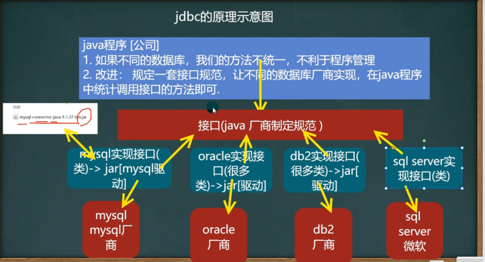
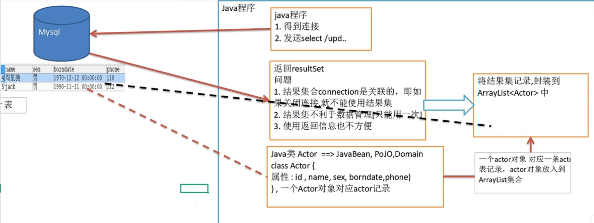
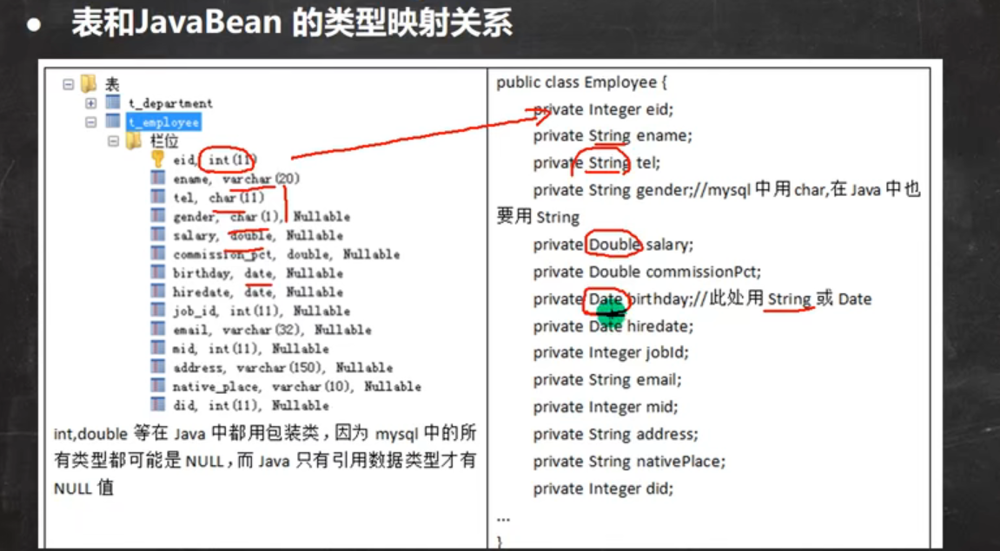
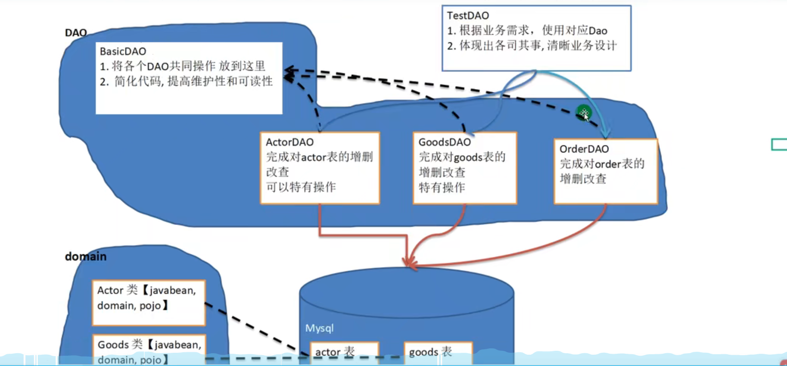

## JDBC
1. 基本介绍 
   1. JDBC为访问不同的数据库提供了统一的接口，为使用者屏蔽了细节问题
   2. Java程序员使用JDBC可以连接任何提供了JDBC驱动程序的数据库系统，从而完成对数据库的各种操作
   3. JDBC基本原理图  
   4. JDBC API是一系列接口，它统一和规范了应用程序和数据库的连接、执行SQL语句，并得到返回结果等各类操作，相关类和接口在java.sql和javax.sql包中
   5. JDBC程序编写步骤
      1. 注册驱动 -加载Driver类
        ```
        首先在mysql.jar文件拷贝到新建的libs文件夹下，右键该文件选择 add as library... 加入到项目中
        Driver driver = new Driver();
        ```
      2. 获取连接
        ```
        // jdbc:mysql: 表示规定好的协议，通过jdbc的方式连接到mysql
        // localhost:3306  表示主机ip和端口号
        // hsp_db02 表示连接的数据库
        // mysql连接本质就是socket连接
        String url = "jdbc:mysql://localhost:3306/hsp_db02";
        // 将用户名和密码放入到 properties 对象
        Properties properties = new Properties();
        properties.setProperty("user", "root");
        properties.setProperty("password", "zx123456");
        // 获取连接
        Connection connect = driver.connect(url, properties);
        ```
      3. 执行增删改查 -发送sql命令给mysql执行
        ```
        String sql = "insert into actor values(null, '刘德华', '男')";
        // 得到statement对象，帮助我们执行静态sql语句并返回其生成的结果的对象
        Statement statement = connect.createStatement();
        int rows = statement.executeUpdate(sql);  // 更新update语句如果是dml语句，返回值为受影响的行数
        ```
      4. 释放资源 -关闭相关连接
        ```
        statement.close();
        connect.close()
        ```
   6. Statement
      1. Statement对象用于执行静态sql语句并返回其生成结果的对象
      2. 在建立连接后，需要对数据库进行访问，执行命令或是sql语句，可以通过
         1. statement 存在sql注入
         2. PreparedStatement 预处理
         3. CallableStatement 存储过程
      3. Statement对象执行sql语句，存在sql注入风险
      4. sql注入是利用某些系统没有对用户输入的数据进行充分的检查，而在用户输入的数据中注入非法的sql语句段或命令，恶意攻击数据库
      5. 防范sql注入，只要用PreparedStatement取代Statement就可以了
   7. PreparedStatement
      1. PreparedStatement执行sql语句中的参数用问好来表示，调用PreparedStatement对象的setXxx()方法来设置这些参数，setXxx方法有两个参数，第一个参数是要设置的sql语句中的参数的索引，从1开始，第二个参数是设置的sql语句中的参数的值
        ```
        String sql = "select count(*) from admin where username =? and password =?"
        PreparedStatement preparedStatement = connect.preparedStatement(sql);
        preparedStatement.setString(1, "admin")
        preparedStatement.setString(2, "zx123456")
        ResultSet resultSet = preparedStatement.executeQuery();
        ```
      2. 调用executeQuery，返会Result对象
      3. 调用executeUpdate，执行更新，包括增删改
      4. 好处：不再用+拼接sql语句，减少语法错误，有效的解决了sql注入问题，并且大大减少编译次数，效率提高
   8. 获取数据库连接的5种方式
      1. 使用 com.mysql.jdbc.Driver(),属于静态加载，灵活性差，依赖性强
      2. 使用Class.forName反射动态获取
        ```
        Class clazz = Class.forName("com.mysql.jdbc.Driver");
        Driver driver = (Driver) clazz.newInstance();
        String url = "jdbc:mysql://localhost:3306/hsp_db02";
        下面相同
        ```
      3. 使用DriverManager替换Driver
        ```
        Class clazz = Class.forName("com.mysql.jdbc.Driver");
        Driver driver = (Driver) clazz.newInstance();
        String url = "jdbc:mysql://localhost:3306/hsp_db02";
        String user = "root";
        String pwd = "zx123456";
        // 用于管理一组JDBC驱动程序的基本服务
        DriverManager.registerDriver(driver); // 注册Driver驱动
        Connection conn = DriverManager.getConnection(url, user, password);
        ```
      4. 使用Class.forName自动完成注册驱动，简化代码，推荐使用
        ```
        Class.forName("com.mysql.jdbc.Driver"); // 这里自动在加载Driver类后完成注册
        String url = "jdbc:mysql://localhost:3306/hsp_db02";
        String user = "root";
        String pwd = "zx123456";
        Connection conn = DriverManager.getConnection(url, user, password);
        ```
         1. mysql驱动5.1.6可以无需Class.forName，从jdk1.5以后使用了jdbc4，不再需要显示调用Class.forName注册驱动而是自动调用驱动jar包下META-INF\services\java.sql.Driver文本中的类名称去注册
          ```
          String url = "jdbc:mysql://localhost:3306/hsp_db02";
          String user = "root";
          String pwd = "zx123456";
          Connection conn = DriverManager.getConnection(url, user, password);
          ```
      5. 使用配置文件，连接数据库更灵活
          ```
          // 通过properties对象获取配置文件的相关信息
          Properties properties = new Properties();
          properties.load(new FileInputStream("src\\mysql.properties"));
          String user = properties.getProperty("user");
          String pwd = properties.getProperty("pwd");
          String driver = properties.getProperty("driver");
          String url = properties.getProperty("url");
          
          Class.forName(driver); 
          Connection conn = DriverManager.getConnection(url, user, password);
          ```
2. ResultSet
   1. 表示数据库结果集的数据表，通常通过执行查询数据库的语句生成
   2. ResultSet对象保持一个光标指向其当前的数据行，最初光标位于第一行之前
   3. next方法将光标移动到下一行，并且由于在ResultSet对象中没有更多行时返回false，因此可以在while循环中使用循环来遍历结果集
      ```
      ResultSet resultSet= statement.executeQuery(sql);  执行给定的sql语句返回单个ResultSet对象
      //ResultSet 是接口类型，这里真正的类型是厂商的 JDBC42ResultSet 类型
      while(resultSet.next()){ // next方法将光标移动到下一行
        int id = resultSet.getInt(1)  // 获取该行第一列数据
        int id = resultSet.getInt("id")  // 通过列名获取该行第一列数据
        String name = resultSet.getInt(2)  // 获取该行第二列数据
        ...
      }
      resultSet.close()  关闭连接
      ```
   4. previous方法将光标移动到上一行
3. 封装JDBCUtils
   1. 在jdbc中，获取连接和释放资源是经常用到的操作，可以将其封装成工具类 JDBCUtils
      ```
      // 定义相关的属性，四个，因为只需要一份。
      private static String user;
      private static String pwd;
      private static String url;
      private static String driver;
      // 初始化
      static {
          Properties properties = null;
          try {
              properties = new Properties();
              properties.load(new FileInputStream("src\\mysql.properties"));
              user = properties.getProperty("user");
              pwd = properties.getProperty("pwd");
              driver = properties.getProperty("driver");
              url = properties.getProperty("url");
          } catch (Exception e) {
              // 实际开发中会转为运行时异常抛出，这时调用者可以选择捕获该异常或默认处理
              throw new RuntimeException(e);
          }
      }
      // 连接数据库，返回connection
      public static Connection getConnection(){
          try {
              return DriverManager.getConnection(url, user, pwd)
          } catch (SQLException e) {
              throw new RuntimeException(e);
          }
      }
      // 关闭资源
      public static void close(ResultSet set, Statement statement, Connection connection){
          try {
              if(set != null){
                  set.close();
              }
              if(statement != null){
                  statement.close();
              }
              if(connection != null){
                  connection.close();
              }
          } catch (SQLException e) {
              throw new RuntimeException(e);
          }
      }
      ```
4. 事务
   1. 基本介绍
      1. JDBC程序中当一个Connection对象创建时，默认情况下自动提交事务，每执行一个sql语句时，如果执行成功，就会向数据库自动提交，不能回滚
      2. JDBC程序中为了让多个sql语句作为一个整体执行，需要使用事务
      3. 调用Connection的setAutoCommit(false)可以取消自动提交事务
      4. 在所有的sql语句都执行成功后，调用connection的commit方法提交事务
      5. 在其中某个操作失败或者出现异常时，调用connection的rollback方法回滚事务
   2. 批处理
      1. 基本介绍
         1. 当需要成批插入或者更新记录时，可以采用Java的批量更新机制，这一机制允许多条语句一次性提交给数据库批量处理
         2. JDBC的批处理语句包括以下方法
            1. addBatch：添加需要批处理的sql语句或者参数
            2. executeBatch：执行批量处理语句
            3. clearBatch：清空批处理包的语句
              ```
              url="jdbc:mysql://localhost:3306/hsp_db02?rewriteBatchedStatement=true";
              PreparedStatement preparedStatement = connect.preparedStatement(sql);
              for(int i=0;i<5000;i++){
                preparedStatement.setString(1, "admin")
                preparedStatement.setString(2, "zx123456")
                preparedStatement.addBatch()
                // 当有1000条记录时批量执行
                if((i+1) % 1000 == 0){
                  preparedStatement.executeBatch()
                  preparedStatement.clearBatch()
                }
              }
              ```
         3. JDBC连接mysql时，如果需要使用批处理功能，请在批处理中添加参数   ?rewriteBatchedStatement=true
         4. 批处理往往和PreparedStatement一起搭配使用，可以即减少编译次数，又减少运行次数，提高效率
      2. 批量处理会减少发送sql语句的网络开销，而且减少编译的次数
5. 数据库连接池
   1. 传统获取connection问题分析
      1. 传统的JDBC数据库连接使用Driver Manager来获取，每次向数据库建立连接的时候都要将connection加载到内存中，再验证ip地址、用户名和密码。需要数据库连接的时候，就向数据库要求一个，频繁进行的进行数据库连接操作将占用很多系统资源，容易造成服务器崩溃
      2. 每一次对数据库进行连接，使用完都需要断开，如果程序异常而未关闭，将导致数据库内存泄漏，最终将导致数据库重启
      3. 传统的获取数据库连接的方式，不能控制创建连接的数量，如果连接过多，也可能导致内存泄漏，mysql崩溃
      4. 所以可以采用数据库连接池解决上述问题
   2. 基本介绍
      1. 数据库连接池预先在缓冲池中放入一定数量的连接，当需要建立数据库连接的时候，只需要从连接池中取出一个，使用完再放回去
      2. 连接池负责分配、管理和释放数据库连接，它允许应用程序重复使用一个现有的数据库连接，而不是新建
      3. 当应用向连接池请求的连接数量超过最大连接数量时，这些请求将被加入到等待队列中
   3. 数据库连接池种类
      1. JDBC的数据库连接池使用 javax.sql.DataSource来表示，DataSource只是一个接口，该接口由第三方实现，提供jar包
      2. C3P0连接池速度慢，但是稳定性好
      3. DBCP连接池速度快，但是不稳定
      4. Proxool连接池有监控连接池状态的功能，稳定性较差
      5. BoneCP连接池速度快
      6. Druid（德鲁伊）是阿里提供的数据库连接池，集DBCP、C3P0、Proxool优点于一身的连接池
   4. C3P0
      ```
      public void test(){
        // 先引入jar包
        // 创建一个数据源连接池对象
        ComboPooledDataSource comboPooledDataSource = new ComboPooledDataSource()
        // 通过配置文件获取相关信息 user、pwd、url、driver 相关代码省略
        // 给数据源设置相关的参数
        comboPooledDataSource.setDriverClass(driver)  // 连接管理都是由comboPooledDataSource来进行管理
        comboPooledDataSource.setJdbcUrl(url)
        comboPooledDataSource.setUser(user)
        comboPooledDataSource.setPassword(pwd)
        // 设置初始化连接数
        comboPooledDataSource.setInitialPoolSize(10)
        // 设置最大连接数
        comboPooledDataSource.setMaxPoolSize(50)
        comboPooledDataSource.getConnection() // 获取连接，这个方法就是从 DataSource 接口实现
        Connection connection = comboPooledDataSource.getConnection() // 获取连接，这个方法就是从 DataSource 接口实现
        connection.close()
      }
      // 第二种方式使用配置文件模板来完成
      public void test1(){
        // 首先将c3p0配置文件 c3p0.config.xml 拷贝到src目录下
        // 该文件指定了连接数据库和连接池的相关参数
        ComboPooledDataSource comboPooledDataSource = new ComboPooledDataSource("hsp_db01") // 参数对应配置文件中的name
        Connection connection = comboPooledDataSource.getConnection()
        connection.close()
      }
      ```
   5. 德鲁伊
      ```
      public void test(){
        // 先引入jar包
        // 首先将 Druid 配置文件拷贝到src目录下
        // 通过Druid配置文件获取相关信息 user、pwd、url、driver 
        Properties properties = new Properties()
        properties.load(new FileInputStream("src\\druid.properties"))
        // 创建一个指定参数的数据库连接池
        DataSource dataSource = DruidDataSourceFactory.createDataSource(properties)
        Connection connection = dataSource.getConnection() 
        connection.close()
      }
      ```
      1. 将JDBCUtils工具类改为德鲁伊 JDBCUtilsByDruid类
      ```
      private static DataSource ds;
      // 初始化
      static {
          Properties properties = new Properties()
          try {
              properties.load(new FileInputStream("src\\druid.properties"))
              ds = DruidDataSourceFactory.createDataSource(properties)
          } catch (Exception e) {
              throw new RuntimeException(e);
          }
      }
      // 连接数据库，返回connection
      public static Connection getConnection() throws SQLException{
          return ds.getConnection()
      }
      // 关闭连接，把连接放回数据库连接池
      public static void close(ResultSet set, Statement statement, Connection connection){
          try {
              if(set != null){
                  set.close();
              }
              if(statement != null){
                  statement.close();
              }
              if(connection != null){
                  connection.close();
              }
          } catch (SQLException e) {
              throw new RuntimeException(e);
          }
      }
      ```
   6. Apache-DBUtils
      1. 问题
         1. 关闭connection后，resultSet结果集无法使用
         2. resultSet不利于数据的管理
         3.  
      2. 简单实现封装resultSet到ArrayList中
        ```
        Actor对象
        public class Actor{
          private Integer id;
          private String name;
          private String sex;
          public Actor(){}  // 无参构造器，底层反射会用到
          public Actor(Integer id, String name,String sex ){
            this.id = id
            this.name = name
            this.sex = sex
          }

        }
        ```
        ```
        ArrayList<Actor> list = new ArrayList<>()
        while(resultSet.next()){ // next方法将光标移动到下一行
          int id = resultSet.getInt("id")  
          String name = resultSet.getString("name") 
          String sex = resultSet.getString("sex") 
          list.add(new Actor(id,name,sex))
        }
        ```
      3. DBUtils类
         1. commons-dbutils 是 Apache 组织提供的一个开源的 JDBC工具类库，他是对JDBC的封装，可以极大简化jdbc编码的工作量
         2. QueryRunner类：该类封装了sql的执行，是线程安全的，可以实现增删改查批处理
         3. ResultSetHandle接口：该接口用于处理 java.sql.ResultSet ,将数据按要求转为另一种形式
            1. ArrayHandle：把结果集中的第一行转为对象数组
            2. ArrayListHandle：把结果集中的每一行都转为对象数组，再存到List中
            3. BeanHandle：把结果集中的第一行数据封装到一个对应的javaBean实例中
            4. BeanListHandle：把结果集中的第一行数据封装到一个对应的javaBean实例中，再存到List中
            5. ColumnListHandle：把结果集中的某一列的数据存放的list中
            6. KeyedHandle(name)：把结果集中的每行都封装到Map里，再把这些map存到一个map中，其key为指定的key
            7. MapHandle：把结果集中的每行都封装到Map里，key是列名，value就是对应的值
            8. MapListHandle：把结果集中的每行都封装到Map里，再存到List中
            ```
            使用德鲁伊和DBUtils工具类完成表的crud操作
            public void test(){
              // 使用德鲁伊得到connection
              Connection connection = JDBCUtilsByDruid.getConnection()
              // 使用 DBUtils 相关类和接口，先引入 DBUtils相关的jar
              // 创建 QueryRunner
              QueryRunner queryRunner = new QueryRunner()
              // 执行相关方法，返回 ArrayList结果集
              String sql = "select * from actor where id =?"
              //queryRunner.query 执行sql查询，得到ResultSet，封装到ArrayList集合中，然后返回
              //new BeanListHandle<>(Actor.class) :在将 resultSet 结果集取出来数据放到 Actor对象，然后封装到Array List中
              //底层使用反射机制获取 Actor类的属性然后进行封装
              // 最后面的参数1 是传给sql语句的问号的，可以有多个
              // 得到的 resultset和PreparedStatement 会在query方法中关闭
              List<Actor> list = queryRunner.query(connection, sql, new BeanListHandle<>(Actor.class), 1)
              // 如果返回的是单个记录，修改第三个参数
              Actor actor = queryRunner.query(connection, sql, new BeanHandle<>(Actor.class), 1)
              JDBCUtilsByDruid.close(null, null, connection)
            }

            // dml操作都是 queryRunner.update ，返回值是受影响的行数
            String sql = "update actor set name = ? where id = ?"
            int affectRow = queryRunner.update(connection, sql, "张三丰", 2)
            ```
      4.  
   7. BasicDao - 通用增删改查方法
      1. 使用德鲁伊和DBUtils工具类操作缺点
         1. sql语句固定，不能通过参数传入，通用性不好
         2. 对于select操作，如果有返回值，返回值类型不能固定，需要使用泛型
         3. 将来的表很多，业务复杂，不可能只用一个Java类完成
         4. BasicDao示意图  
      2. 说明
         1. DAO：data access object 数据访问对象
         2. 这样的通用类被称为basicDao，是专门和数据库交互的，即完成对数据库（表）的crud操作
         3. 在 BasicDao 的基础上，实现一张表对应一个 dao，更好的完成功能，比如 Customer表-Customer.java类(javabean)-CustomerDao.java
      3. 应用实例
         1. 完成一个简单设计
            1. com.hsp.dao_
               1. com.hsp.dao_.utils // 工具类
                  1. 第一个文件是上面 5.5.1 的JDBCUtilsByDruid类
               2. com.hsp.dao_.domain // javabean
                  1. 上面 5.6.2 的 Actor 类
               3. com.hsp.dao_.dao // 存放XxxDao和BasicDao
                  ```
                  BasicDao ,其他DAO的父类
                  public class BasicDao<T>{  // 泛型指定具体类型
                    private QueryRunner qr = new QueryRunner()
                    // 开发通用的dml操作，针对任意的表
                    public int update(String sql, Object... params){
                      Connection connection = null
                      try {
                          connection = JDBCUtilsByDruid.getConnection()
                          int update = qr.update(connection, sql, params)
                          return update
                      } catch (SQLException e) {
                          throw new RuntimeException(e);
                      } finally{
                        JDBCUtilsByDruid.close(null, null, connection)
                      }
                    } 
                    // 返回多个对象，即查询结果是多行的，针对任意表
                    public List<T> queryMulti(String sql, Class<T> clazz, Object... params){
                      Connection connection = null
                      try {
                          connection = JDBCUtilsByDruid.getConnection()
                          return List<T> query = qr.query(connection, sql, new BeanListHandler<T>(clazz), params)
                      } catch (SQLException e) {
                          throw new RuntimeException(e);
                      } finally{
                        JDBCUtilsByDruid.close(null, null, connection)
                      }
                    }
                    // 查询单行结果的通用方法
                    public T querySingle(String sql, Class<T> clazz, Object... params){
                      Connection connection = null
                      try {
                          connection = JDBCUtilsByDruid.getConnection()
                          return qr.query(connection, sql, new BeanHandler<T>(clazz), params)
                      } catch (SQLException e) {
                          throw new RuntimeException(e);
                      } finally{
                        JDBCUtilsByDruid.close(null, null, connection)
                      }
                    }
                    // 查询单行单列的方法，即返回单值的方法
                    public Object queryScalar(String sql, Object... params){
                      Connection connection = null
                      try {
                          connection = JDBCUtilsByDruid.getConnection()
                          return qr.query(connection, sql, new ScalarHandler(), params)
                      } catch (SQLException e) {
                          throw new RuntimeException(e);
                      } finally{
                        JDBCUtilsByDruid.close(null, null, connection)
                      }
                    }
                  }
                  ```
                  ```
                  ActorDAO
                  public class ActorDAO extends BasicDao<Actor>{
                    // 现在已经有 BasicDAO的所有方法了，可以添加自己特有的方法
                  }
                  ```
               4. com.hsp.dao_.test // 写测试类
                  ```
                  public class TestDAO{
                    public class TestActorDAO(){
                      ActorDAO actorDAO = new ActorDAO()
                      // 测试查询语句
                      List<Actor> actors = actorDAO.queryMulti("select * from actor where id >= ?", Actor.class, 1)
                    }
                  }
                  ```